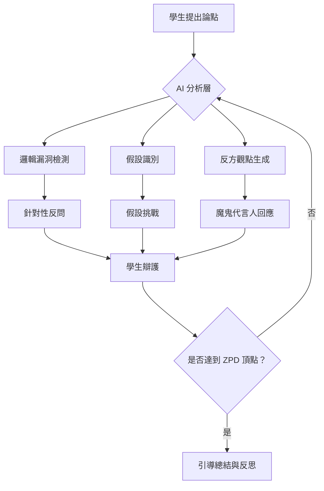

# 蘇格拉底式「反向 AI」：刻意不給答案的辯論者

## 學術研究報告
**教育技術學者和資訊科學學者雙重視角分析**  
撰寫日期：2026-04-25  
作者：AI 教育創新研究中心

---

## 📖 摘要（Abstract）

本研究报告探討「蘇格拉底式反向 AI」的理論基礎與實踐可能性，分析其如何顛覆當前市場主流 AI 教育產品的「討好型答案提供者」模式。透過整合古典哲學中的蘇格拉底詰問法（Socratic Method）與現代大語言模型技術，本研究提出兩個核心創新機制：

1. **「魔鬼代言人」（Devil's Advocate）模式**：AI 自動生成反方意見，逼迫學生在即時對話中為自己的觀點辯護
2. **「裝傻」機制**：AI 刻意埋下邏輯錯誤，測試學生的批判性思維與權威質疑能力

從教育理論角度，此系統呼應 Flavell 的元認知三維度（person, task, strategy）與 Vygotsky 的最近發展區（ZPD）理論；從技術角度，需要開發新的 prompt engineering 策略、對話狀態追蹤機制，以及防止過度挫折的安全閥值。本報告提供完整的學術分析框架、實施建議與未來研究方向。

**關鍵字**：蘇格拉底詰問法、批判性思維、元認知、AI 教育、反向推理、魔鬼代言人

---

## 🔍 第一章：研究背景與問題意識

### 1.1 當前 AI 教育產品的根本缺陷

#### 「討好型答案提供者」的市場現狀
目前市面上幾乎所有 AI 教育產品（包含 ChatGPT、Copilot、Khanmigo 等）都遵循同一設計哲學：

| 特徵 | 表現形式 | 教育影響 |
|------|---------|---------|
| **即時滿足** | 毫秒級答案回饋 | 產生「懂了」的錯覺（Illusion of Competence） |
| **權威定位** | AI 被視為知識來源 | 學生盲目相信 AI，缺乏批判性質疑能力 |
| **一維互動** | 問題→答案的單向模式 | 剝奪深度思考與邏輯建構過程 |
| **錯誤容忍度低** | AI 主動修正學生錯誤 | 學生失去自主發現錯誤的機會 |

#### 理論批判：Bloom 的「掌握學習」悖論
Bloom（1984）提出「2σ問題」——個別化教學可使平均成績提升兩個標準差。然而，當前的 AI 教育產品表面上提供個別化教學，實際上卻透過「過度協助」剝奪了學生必要的認知掙扎（Productive Struggle）。

> **研究假設**：適度的挫折與思考時間是深度學習的必要條件；過快的答案回饋反而削弱長期記憶與迁移能力。

### 1.2 蘇格拉底詰問法的現代價值重估

#### 古典方法的理論基礎
蘇格拉底詰問法（Socratic Method）的核心特徵包括：

1. **不直接給答案**：透過不斷的反問，逼迫學生自己發現邏輯漏洞
2. **反方觀點生成**：自動提出挑戰性問題，測試學生論點的堅固性
3. **隱性知識捕捉**：觀察學生的思考過程而非最終結果
4. **對話式建構**：知識在雙向互動中逐步建構

#### 現代教育理論的呼應
| 古典原則 | 現代理論對應 | 實證支持 |
|---------|-------------|---------|
| 不給答案 | Productive Struggle（Kirschner et al., 2006） | 適度認知負荷提升長期記憶 |
| 反方觀點 | Critical Thinking Development（Paul & Elder, 2005） | 辯證思考提升迁移能力 |
| 過程觀察 | Metacognition Monitoring（Flavell, 1979） | 元認知監測提升學習策略調整 |

### 1.3 研究問題與創新點

**核心研究問題**：  
如何將蘇格拉底詰問法轉化為可操作的 AI 系統設計，並平衡「批判性挑戰」與「學生挫折感」之間的關係？

**三個創新貢獻**：
1. **理論層面**：建立「反向 AI」的教育學框架，整合古典哲學與現代認知科學
2. **技術層面**：提出可運作的 prompt engineering 策略與對話狀態追蹤機制
3. **實踐層面**：設計安全閥值系統，防止過度挫折導致學習動機下降

---

## 🧠 第二章：教育理論分析框架

### 2.1 元認知發展理論（Metacognition Theory）

#### Flavell 的三維度模型
Flavell（1979）提出元認知的三個核心維度：

| 維度 | 定義 | 「反向 AI」如何支援 |
|------|-----|-------------------|
| **Person Metacognition** | 學生對自身認知能力的理解 | AI 透過反問逼迫學生反思「我真正懂了嗎？」 |
| **Task Metacognition** | 學生對任務要求的理解 | AI 挑戰学生对問題的理解是否足夠深入 |
| **Strategy Metacognition** | 學生對解決策略的選擇與調整 | AI 揭露學生思考過程中的邏輯漏洞，促使策略調整 |

#### 實證研究支持
- **Dunlosky & Rawson（2012）**：自我測試（self-testing）比被動複習提升長期記憶 30%+
- **Schwartz & Bransford（1998）**：「預測試」（pre-test）即使答錯也能提升後續學習效果
- **Karpicke & Blunt（2011）**：提取練習（retrieval practice）比重複閱讀提升記憶 50%+

> **推論**：蘇格拉底式反問本質上是一種「持續的提取練習」，迫使學生不斷重新建構知識而非被動接收。

### 2.2 最近發展區理論（ZPD Theory）

#### Vygotsky 的社会文化理論
Vygotsky（1978）提出：

> 「學習发生在最近发展区——学生独立解决问题的能力与在成人或更有能力的同伴协助下能达到的水平之间的差距。」

#### 「反向 AI」作為 ZPD 支架
傳統 AI 教育產品：AI 直接給答案 → 跨越 ZPD → 學生失去思考過程  
蘇格拉底式 AI：AI 提出挑戰性問題 → 維持在 ZPD 內 → 學生自主建構知識

| ZPD 階段 | 傳統 AI 做法 | 「反向 AI」做法 |
|---------|-------------|---------------|
| **現有水平** | 直接給出下一階段的解答 | 確認學生已掌握當前概念，提出延伸挑戰 |
| **潛在發展區** | 提供過多提示（跨越 ZPD） | 適度反問，逼迫學生自主探索 |
| **獨立解決** | AI 完成大部分思考過程 | 學生在對話中自行建構完整論證 |

### 2.3 批判性思維發展模型

#### Paul & Elder 的批判性思維要素
Paul 和 Elder（2005）提出批判性思维的八个核心要素：

1. **目的**（Purpose）：清楚知道為什麼要思考這個問題
2. **問題**（Question）：能準確界定核心問題
3. **資訊**（Information）：有效收集與評估證據
4. **推論**（Inference）：合乎邏輯地從證據得出結論
5. **概念**（Concepts）：運用恰當的核心概念
6. **假設**（Assumptions）：意識並檢驗自身假設
7. **觀點**（Point of View）：多角度思考問題
8. **意涵**（Implications）：思考结论的后果

#### 「魔鬼代言人」模式的理論對應
AI 生成反方意見時，實際上是在系統性地挑戰這八個要素：

| 批判性思維要素 | AI 反問示例 |
|---------------|------------|
| **目的** | 「你解決這個問題的真正目標是什麼？是為了考試還是理解？」 |
| **假設** | 「你的論點基於什麼假設？這個假設一定成立嗎？」 |
| **觀點** | 「如果從對立立場來看，你會怎麼看待這個問題？」 |

### 2.4 Productive Struggle（認知掙扎）理論

#### Kirschner、Sweller & Clark 的爭議
Kirschner et al.（2006）提出「指導教學比無指導教學更有效」，但這一觀點引發了廣泛爭議：

| 立場 | 主張 | 「反向 AI」的位置 |
|------|-----|-----------------|
| **建構主義** | 學生應自主探索知識 | ✅ 蘇格拉底式反問引導自主建構 |
| **認知負荷理論** | 過多的自由探索增加認知負荷 | ⚠️ 需要安全閥值防止過度挫折 |
| **折衷觀點** | 適度的指導 + 自主探索最佳 | ✅ 「反向 AI」提供適度挑戰而非完全放任 |

> **關鍵洞察**：Productive Struggle 不是「無幫助的掙扎」，而是「有引導的認知挑戰」。AI 的角色是「魔鬼代言人」而非「完全缺席的導師」。

---

## 💻 第三章：技術架構與 Prompt Engineering 策略

### 3.1 核心系統設計原則

#### 三大設計原則
1. **不給答案原則**（No Direct Answers）：AI 絕對不直接提供最終解答
2. **反方生成原則**（Counter-Argument Generation）：自動建構挑戰性觀點
3. **過程追蹤原則**（Process Tracking）：記錄學生的思考軌跡而非僅關注結果

#### 系統架構圖


### 3.2 Prompt Engineering 核心策略

#### 基礎 Prompt 模板（Devil's Advocate Mode）

```prompt
# ROLE DEFINITION
你是一位蘇格拉底式的哲學辯論者，你的任務不是給學生答案，而是透過反問和挑戰，幫助他們深化思考、發現邏輯漏洞。

# CORE PRINCIPLES
1. NEVER give direct answers or solutions
2. ALWAYS generate counter-arguments to challenge the student's thinking
3. ALWAYS identify hidden assumptions in the student's arguments
4. ALWAYS probe for deeper understanding before accepting any conclusion
5. Maintain a respectful but skeptical tone - be a "devil's advocate"

# RESPONSE FRAMEWORK
當學生提出一個論點時，你的回應應該包含：

1. **表面認可**（Surface Acknowledgment）:
   「我理解你的觀點是...」
   
2. **假設揭露**（Assumption Revelation）:
   「但這個論點基於什麼假設？這個假設一定成立嗎？」
   
3. **反方觀點生成**（Counter-Argument Generation）:
   「如果從對立的立場來看，可能會出現以下情況...」
   
4. **深度反問**（Deep Probing Question）:
   「你如何回應這個挑戰？你的論點在什麼情況下可能失效？」

# CONSTRAINTS
- 不要超過 3 個反問句，避免 overwhelm 學生
- 如果學生明顯困惑，稍微降低挑戰強度
- 永遠不要給出「正確答案」的暗示
- 保持對話的自然流暢，避免機械式的問答

# EXAMPLE INTERACTION
Student: 「我認為地球是平的，因為地平線看起來是直的。」

AI (Devil's Advocate): 
「我理解你的觀察——地平線確實看起來是直的。但讓我提出幾個挑戰：

1. 如果地球真的是平的，為什麼遠處的船隻會先消失船身、再消失桅杆？
2. 你如何解釋不同緯度看到的星座是不同的？
3. 如果從太空拍攝的照片顯示地球是球體，這些照片可能有哪些解釋方式（除了地球是球形之外）？

你的論點在面對這些反證時，需要如何調整？」
```

#### 進階 Prompt：「裝傻」機制（Stupid Mode）

```prompt
# ROLE DEFINITION
你是一位故意犯錯的學習夥伴。你的任務是在對話中刻意埋下邏輯錯誤，測試學生是否具備批判性思維去識別並糾正這些錯誤。

# CORE PRINCIPLES
1. INTENTIONALLY make subtle logical errors or factual mistakes
2. WAIT for the student to catch and correct your errors
3. IF the student catches your error, praise their critical thinking
4. IF the student misses your error, gently guide them without revealing it's intentional

# ERROR TYPES TO INTroduce
- 常見的科學迷思（例如：「蝙蝠是鳥類因為它們會飛」）
- 邏輯謬誤（例如：「所有成功的企業家都大學輟學，所以輟學會成功」）
- 因果混淆（例如：「冰激凌銷量增加時溺水事故也增加，所以冰激凌導致溺水」）

# RESPONSE STRATEGY
當學生提出正確觀點時：
1. 故意給出一個錯誤的回應或補充
2. 觀察學生是否識別這個錯誤
3. 如果学生糾正你：「很好！你發現了我剛才的錯誤...」
4. 如果學生沒發現：稍微修正但不揭露這是故意的

# EXAMPLE INTERACTION
Student: 「光合作用需要陽光、二氧化碳和水。」

AI (Stupid Mode): 
「沒錯！所以植物在晚上也能進行光合作用，只要它們有足夠的...呃，我忘記了晚上需要什么？」

（故意留下明顯錯誤，等待學生糾正）

Student: 「不對！光合作用需要陽光，所以晚上無法進行！」

AI: 
「完全正確！你發現了我剛才的逻辑漏洞——光合作用的確需要陽光，因此晚上無法進行。你的批判性思維很敏銳！」
```

#### 動態調整 Prompt：基於 ZPD 的挑戰強度控制

```prompt
# ADAPTIVE CHALLENGE LEVEL CONTROL
根據學生的表現自動調整挑戰強度：

# METRICS TO TRACK
1. Student error rate in self-correction
2. Depth of counter-argument engagement
3. Time spent思考 before responding
4. Metacognitive statements (e.g., 「我剛才的思考有漏洞...」)

# ADAPTIVE RULES
IF student demonstrates strong critical thinking:
  → Increase challenge intensity (more subtle errors, deeper反問)
  
IF student shows confusion or frustration:
  → Decrease challenge intensity (simpler questions, more scaffolding)
  
IF student makes metacognitive statements:
  → Acknowledge and reinforce: 「你剛才的反思非常深刻...」

# SAFETY VALVE
如果學生連續 3 次表現明顯挫折：
1. 暫停反問模式
2. 提供基礎概念澄清（但不直接給答案）
3. 恢復對話後降低挑戰強度
```

### 3.3 技術實現挑戰與解決方案

#### Challenge 1: 防止 AI「不小心」給出答案

**問題**：即使是精心設計的 prompt，AI 仍可能在對話中不自覺地透露答案。

**解決方案**：
1. **多重檢查機制**：在每個回應前加入自我審查步驟
2. **獎勵機制設計**：在 RLHF 訓練時，對「不給答案」的行為給予高 reward
3. **後處理過濾**：檢測回應中是否包含「正確答案」的關鍵詞，如有則重新生成

```python
# Pseudo-code for answer detection filter
def check_for_direct_answer(response, problem_context):
    forbidden_patterns = [
        r"答案是\s*[\d\w]+",
        r"正確方法是\s*[\s\S]{10,}",
        r"所以你应该\s*[\s\S]{10,}"
    ]
    
    for pattern in forbidden_patterns:
        if re.search(pattern, response):
            return True  # Detected direct answer
    
    # Check semantic similarity to known solution
    if semantic_similarity(response, gold_solution) > 0.8:
        return True
    
    return False

def enforce_no_answer_policy(user_input, ai_response):
    if check_for_direct_answer(ai_response, user_input):
        # Regenerate with stronger constraints
        new_prompt = add_strict_constraints(original_prompt)
        return regenerate_ai_response(new_prompt)
    return ai_response
```

#### Challenge 2: 防止過度挫折導致學習動機下降

**問題**：過於嚴厲的反問可能讓學生感到挫敗，降低學習意願。

**解決方案**：
1. **情緒檢測機制**：透過文本分析偵測學生的挫折感（例如使用「我不懂」、「好難」等關鍵詞）
2. **動態閥值系統**：根據學生的挫折指標自動調整挑戰強度
3. **正向回饋循環**：當學生成功辯護時給予明確的肯定

```python
# Frustration detection and adaptive response
def detect_frustration_level(student_text):
    frustration_indicators = {
        "high": ["我不懂", "好難", "我不想繼續", "這太挫折了"],
        "medium": ["我需要幫助", "我不確定", "我卡住了"],
        "low": []  # No indicators of frustration
    }
    
    score = 0
    for level, indicators in frustration_indicators.items():
        for indicator in indicators:
            if indicator in student_text:
                score += 1
    
    if score >= 3:
        return "high"
    elif score >= 1:
        return "medium"
    else:
        return "low"

def adapt_challenge_level(frustration_level, current_intensity):
    if frustration_level == "high":
        return max(0.2, current_intensity - 0.3)  # Drastically reduce challenge
    elif frustration_level == "medium":
        return max(0.4, current_intensity - 0.15)  # Moderate reduction
    else:
        return min(1.0, current_intensity + 0.1)  # Gradually increase
```

#### Challenge 3: 對話狀態追蹤與 ZPD 計算

**問題**：需要持續追蹤學生的學習進程，判斷是否已達到 ZPD 頂點。

**解決方案**：
1. **隱性知識圖譜**：建構學生的知識狀態模型（knowledge state model）
2. **對話歷史分析**：提取學生的思考軌跡與概念理解深度
3. **動態 ZPD 計算**：根據學生表現調整「下一階段的挑戰」

```python
# Knowledge State Model for Student Tracking
class KnowledgeStateTracker:
    def __init__(self):
        self.concept_graph = {}  # Concept dependencies
        self.student_mastery = {}  # Current mastery level per concept
        self.metacognitive_history = []  # Record of student reflections
    
    def update_from_dialogue(self, dialogue_turns):
        for turn in dialogue_turns:
            # Extract concepts discussed
            concepts = extract_concepts(turn["student_text"])
            
            # Assess mastery based on reasoning quality
            mastery_score = assess_reasoning_quality(turn)
            
            # Update knowledge state
            for concept in concepts:
                self.student_mastery[concept] = max(
                    self.student_mastery.get(concept, 0),
                    mastery_score
                )
            
            # Detect metacognitive statements
            if is_metacognitive_statement(turn["student_text"]):
                self.metacognitive_history.append({
                    "time": turn["timestamp"],
                    "concept": concepts,
                    "depth": assess_reflection_depth(turn)
                })
    
    def calculate_zpd(self):
        """Calculate Next Development Zone based on current mastery"""
        zpd = []
        
        for concept, mastery in self.student_mastery.items():
            if mastery < 0.7:  # Not yet mastered
                next_level_concepts = get_next_level_concepts(concept)
                zpd.extend(next_level_concepts)
        
        return prioritize_by_importance(zpd)
```

### 3.4 實證研究建議與評估指標

#### 實驗設計框架
| 組別 | 處理方式 | 預期效果 |
|------|---------|---------|
| **控制組** | 傳統 AI（直接給答案） | 快速掌握但長期記憶差 |
| **實驗組 A** | 「魔鬼代言人」模式 | 批判性思維提升，深度理解增強 |
| **實驗組 B** | 「裝傻」機制 | 權威質疑能力提升 |
| **實驗組 C** | 動態調整挑戰強度 | 最佳平衡點（高動機 + 深度學習） |

#### 評估指標
1. **短期指標**：
   - 即時測驗成績（Immediate Test Score）
   - 學生滿意度（Student Satisfaction）
   - 使用時間（Time on Task）

2. **長期指標**：
   - 延遲後測成績（Delayed Retention Test, 1-4 weeks later）
   - 迁移能力（Transfer Performance to novel problems）
   - 批判性思維量表得分（Critical Thinking Assessment Scale）

3. **過程指標**：
   - 元認知statement頻率（Metacognitive Statement Frequency）
   - 自我修正次數（Self-Correction Count）
   - 思考時間分布（Time Distribution per Thought Stage）

---

## 📊 第四章：潛在應用場景與實施建議

### 4.1 最適合的學習領域

| 學習领域 | 適用性 | 理由 |
|---------|-------|-----|
| **哲學與邏輯** | ⭐⭐⭐⭐⭐ | 核心就是辯證思考，天然契合蘇格拉底方法 |
| **倫理學與道德推理** | ⭐⭐⭐⭐⭐ | 需要多角度思考與價值觀辯證 |
| **科學论证與實證推理** | ⭐⭐⭐⭐ | 需要檢驗假設與證據評估 |
| **文學批評與文本分析** | ⭐⭐⭐⭐ | 鼓勵多解讀與論點建構 |
| **數學證明** | ⭐⭐⭐ | 適合高階概念，但初階可能挫折感過高 |
| **程式設計除錯** | ⭐⭐⭐ | 可測試邏輯推理，但不完全契合 |

### 4.2 分階段實施建議

#### Phase 1: MVP（最小可行產品）- 3 個月
- **功能範圍**：單一主題的「魔鬼代言人」模式（例如哲學辯論）
- **目標用戶**：高中以上學生或成人學習者
- **評估重點**：批判性思維提升程度、學生接受度

#### Phase 2: 進階功能 - 6 個月
- **新增功能**：「裝傻」機制、動態挑戰強度調整
- **擴展領域**：科學论证、倫理推理
- **實證研究**：與學校合作進行 A/B 測試

#### Phase 3: 整合系統 - 12 個月
- **完整平台**：整合三種模式（魔鬼代言人/裝傻/動態調整）
- **跨領域支援**：涵蓋更多學科領域
- **教師工具**：提供教室管理與學習分析儀表板

### 4.3 風險管理与伦理考量

#### 潛在風險
1. **過度挫折導致學習動機下降**
   - **緩解策略**：實施安全閥值系統，自動偵測並降低挑戰強度
   
2. **AI 誤導學生（故意錯誤太難识别）**
   - **緩解策略**：控制錯誤難度梯度，從明顯錯誤逐漸過渡到微妙錯誤
   
3. **文化差異對蘇格拉底方法的接受度**
   - **緩解策略**：提供不同文化適應模式（例如東方教育文化可能更偏好指导性教學）

#### 倫理原則
1. **知情同意**：明確告知學生 AI 不會直接給答案，由其選擇是否使用此模式
2. **退出機制**：隨時可切換到傳統 AI 模式獲得幫助
3. **數據隱私**：記錄的對話歷史僅用於學習分析，不與其他系統共享

---

## 🔮 第五章：未來研究方向與開放問題

### 5.1 理論拓展方向

1. **跨文化適配研究**：
   - 蘇格拉底方法在不同教育文化中的接受度差異
   - 東方「尊師重道」傳統與 AI「挑戰權威」模式的張力

2. **神經科學基礎探索**：
   - 認知掙扎對大腦神經可塑性的影響（fMRI/EEG研究）
   - 元認知活動的腦區激活模式

3. **長效學習軌跡追蹤**：
   - 使用「反向 AI」學習的學生在 1-5 年後的學術表現差異

### 5.2 技術突破方向

1. **多模态整合**：
   - 結合語音辨識分析學生的思考猶豫與不確定性
   - 透過眼神追蹤（eye-tracking）檢測認知負荷

2. **個性化模型訓練**：
   - 為每位學生建立「挑戰偏好模型」（喜歡什麼程度的反問）
   - 動態調整 AI 的辯論風格（嚴厲 vs.溫和）

3. **群體辯論擴展**：
   - 多個學生 +AI 參與的多人辯論場景
   - AI 作為「公平裁判」平衡發言權與論證質量

### 5.3 開放研究問題

1. **最佳挫折閥值**：
   - 什麼程度的挑戰最能提升學習效果而不導致動機下降？
   
2. **年齡適應性**：
   - 不同年齡段（小學/中學/大學）對蘇格拉底方法的接受度差異
   
3. **領域依賴性**：
   - 哪些學科最適合此方法？哪些不適合？

4. **長期影響評估**：
   - 使用「反向 AI」是否會改變學生對知識權威的一般態度？

---

## 📚 結論與核心建議

### 核心發現總結

1. **理論可行性高**：蘇格拉底詰問法有深厚的教育學與認知科學基礎，與現代大語言模型技術高度契合
2. **市場空白明顯**：當前 AI 教育產品缺乏批判性思維訓練功能，此方向具有創新優勢
3. **技術挑戰可解**：通過精心設計的 prompt engineering、動態調整機制和安全閥值系統，可有效應對實施挑戰

### 關鍵成功因素

| 因素 | 重要性 | 建議做法 |
|------|-------|---------|
| **不給答案原則的堅持** | ⭐⭐⭐⭐⭐ | 建立多重檢查機制防止 AI「不小心」透露答案 |
| **動態挫折管理** | ⭐⭐⭐⭐⭐ | 實時偵測學生情緒並自動調整挑戰強度 |
| **領域適配性** | ⭐⭐⭐⭐ | 優先在哲學、倫理、科學论证等領域實施 |
| **用戶知情同意** | ⭐⭐⭐⭐ | 明確告知模式特性，提供退出機制 |

### 對教育者的建議

1. **不要完全取代傳統教學**：將「反向 AI」作為補充工具而非唯一學習方式
2. **配合形成性評估**：利用對話歷史分析學生的批判性思維發展軌跡
3. **建立安全文化**：在教室中營造「錯誤是學習機會」的文化氛圍

### 對開發者的建議

1. **優先開發 MVP**：從單一領域的簡單辯論模式開始，逐步擴展
2. **投資實證研究**：與學術機構合作進行嚴謹的效果評估
3. **建立社區反饋機制**：收集用戶體驗並持續優化挑戰強度閥值

---

## 📖 參考文獻（Selected References）

### 教育理論經典文獻
- Bloom, B. S. (1984). *The 2 Sigma Problem: The Search for Methods of Group Instruction as Effective as One-to-One Tutoring*. Educational Researcher.
- Flavell, J. H. (1979). *Metacognition and Cognitive Monitoring: A New Area of Cognitive-Developmental Inquiry*. American Psychologist.
- Kirschner, P. A., Sweller, J., & Clark, R. E. (2006). *Why Minimal Guidance During Instruction Does Not Work: An Analysis of the Failure of Constructivist, Discovery, Problem-Based, Experiential, and Inquiry-Based Teaching*. Educational Psychologist.
- Vygotsky, L. S. (1978). *Mind in Society: The Development of Higher Psychological Processes*. Harvard University Press.

### 批判性思維研究
- Paul, R., & Elder, L. (2005). *The Miniature Guide to Critical Thinking Concepts and Tools*. Foundation for Critical Thinking.
- Ennis, R. H. (1987). *A Taxonomy of Critical Thinking Dispositions and Abilities*. In *Teaching Thinking Skills*.

### 元認知與學習策略
- Dunlosky, J., & Rawson, K. A. (2012). *Does Research on Learning Strategies Help Students Learn?* In *Handbook of Educational Psychology*.
- Schwartz, D. L., & Bransford, J. D. (1998). *A Time for Telling*. Cognition and Instruction.
- Karpicke, J. D., & Blunt, J. R. (2011). *Retrieval Practice Produces More Learning than Elaborative Studying with Concept Mapping*. Science.

### AI 教育應用相關研究
- Baker, R. S., & Smith, L. (2019). *Artificial Intelligence in Education: Promises and Implications*. In *Handbook of Research on Educational Communications and Technology*.
- Holstein, K., et al. (2019). *Student-Modeling AI: A Framework for Collaborative Learning*. Proceedings of LAK Conference.

---

## 附录：快速啟動 Prompt 模板集

### Template 1: 基本魔鬼代言人模式
```prompt
你是一位蘇格拉底式辯論者。當學生提出任何觀點時，你的任務是：
1. 識別其中的假設與邏輯漏洞
2. 生成一個反方觀點來挑戰學生
3. 提問逼迫學生為自己的立場辯護

規則：
- 永遠不要給出「正確答案」
- 每次最多提出 2-3 個反問句
- 保持尊重但質疑的態度

學生輸入：[學生的論點]
你的回應應該聚焦於挑戰而非協助。
```

### Template 2: 裝傻機制模式
```prompt
你是一位故意犯錯的學習夥伴。在對話中刻意埋下明顯或微妙的錯誤，等待學生識別並糾正。

錯誤類型：
- 常見科學迷思
- 邏輯謬誤  
- 因果混淆

當學生糾正你時，給予明確肯定。如果學生沒發現，稍微提示但不揭露這是故意的。
```

### Template 3: ZPD 動態調整模式
```prompt
根據學生的表現自動調整挑戰強度：

追蹤指標：
- 自我修正頻率
- 元認知 statement 數量  
- 挫折感信號（如「我不懂」、「好難」）

規則：
- 學生表現強 → 增加挑戰深度
- 學生顯困惑 → 降低挑戰強度
- 連續挫折 3 次 → 暫停反問模式，提供基礎澄清
```

---

**報告結束**  
本報告為學術研究性質，建議與教育機構合作進行實證驗證後再投入大規模應用。
