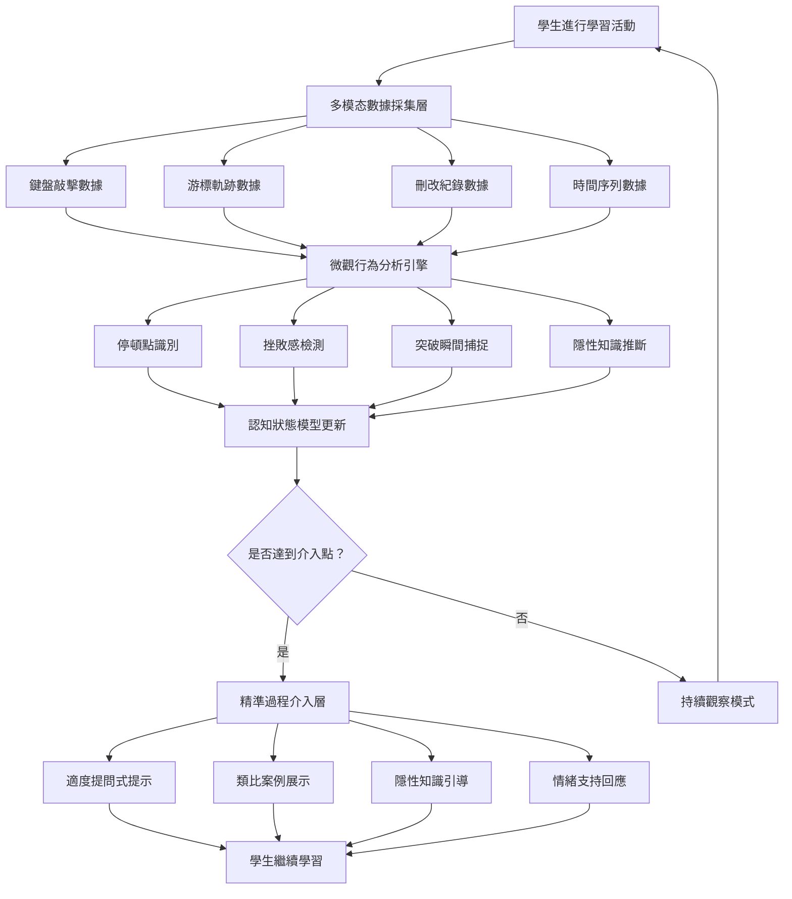

# 數位師徒制：捕捉「隱性知識」與微觀認知軌跡

## 學術研究報告
**教育技術學者和資訊科學學者雙重視角分析**  
撰寫日期：2026-04-25  
作者：AI 教育創新研究中心

---

## 📖 摘要（Abstract）

本研究报告探討「數位師徒制」（Digital Apprenticeship）的理論基礎與實踐可能性，分析其如何顛覆當前 AI 教育產品僅關注「輸入→輸出」的二維評估模式。透過整合傳統師徒制（Apprenticeship Model）中的過程觀察理念與現代多模态感測技術、大語言模型的分析能力，本研究提出兩個核心創新機制：

1. **微觀過程分析**（Micro-Process Analysis）：AI 透過鍵盤敲擊頻率、游標軌跡、刪改紀錄等細粒度數據，分析學生的「認知停頓點」與思考軌跡
2. **精準的過程介入**（Precision Process Intervention）：AI 在學生卡關時提供適度的、非直接解答的提示，模仿真正師傅的指導方式

從教育理論角度，此系統呼應 Polanyi 的隱性知識理論（Tacit Knowledge）、 situated learning 情境學習理論，以及 Vygotsky 的支架式教學（Scaffolding）；從技術角度，需要開發新的多模态數據採集機制、認知狀態識別算法，以及「留白藝術」式的介入策略。本報告提供完整的學術分析框架、實施建議與未來研究方向。

**關鍵字**：數位師徒制、隱性知識、過程評估、微觀認知軌跡、支架式教學、多模态學習分析

---

## 🔍 第一章：研究背景與問題意識

### 1.1 當前 AI 教育產品的「二維盲點」

#### 「輸入→輸出」的簡化評估模式
目前市面上幾乎所有 AI 教育產品都遵循同一評估邏輯：

```
學生輸入（題目/問題） → AI 處理 → 學生輸出（答案） → AI 評判（對錯）
```

| 特徵 | 表現形式 | 教育學缺陷 |
|------|---------|-----------|
| **結果导向** | 僅關注最終答案的正確性 | 忽略思考過程中的學習機會 |
| **二元評判** | 對/錯的二分法 | 無法捕捉部分理解或接近正確的狀態 |
| **靜態分析** | 忽略時間維度的思考軌跡 | 失去診斷學生認知障礙的機會 |
| **即时回饋** | 秒級答案回饋 | 剝奪學生必要的自我反思時間 |

#### Polanyi 隱性知識理論的遺漏
Polanyi（1967）提出著名論斷：「我們知道的比我們能說出的多」（We know more than we can tell）。師徒制的核心價值在於捕捉這些**無法言傳的隱性知識**（Tacit Knowledge），包括：

- **手部技巧的微妙感覺**（例如：書法筆畫的力度控制）
- **思考過程的猶豫與調整**（例如：寫作時的刪改決策）
- **專業直覺的形成軌跡**（例如：程式設計師除錯的經驗判斷）

當前的 AI 教育產品完全遺漏了這些隱性知識的捕捉，僅關注可明確表述的「最終答案」。

> **研究假設**：學習過程中的微觀行為數據（敲擊頻率、游標軌跡、刪改紀錄）包含了豐富的隱性知識信息，AI 若能識別並介入這些關鍵點，將大幅提升教學效果。

### 1.2 傳統師徒制的現代價值重估

#### 師傅的「過程觀察」智慧
傳統師徒制中，師傅對徒弟的指導包括：

| 觀察維度 | 具體表現 | 教育意義 |
|---------|---------|---------|
| **猶豫點**（Hesitation） | 「你剛才在這裡停頓了三秒」 | 識別認知障礙點 |
| **手法不順**（Clumsiness） | 「這個動作你做起來很吃力」 | 診斷技能薄弱環節 |
| **重複錯誤**（Repetition） | 「這是你第三次犯同樣的錯誤了」 | 追蹤學習進度與頑固迷思 |
| **突破性瞬間**（Breakthrough） | 「你剛才突然掌握了關鍵技巧！」 | 強化成功經驗與自信 |

#### 現代教育理論的呼應
| 傳統師徒原則 | 現代理論對應 | 實證支持 |
|-------------|-------------|---------|
| 過程觀察 | Learning Analytics（Wise et al., 2018） | 細粒度數據提升診斷精準度 |
| 精準介入 | Scaffolding Theory（Wood et al., 1976） | 適度支架提升 ZPD 內學習效率 |
| 隱性知識傳遞 | Situated Learning (Lave & Wenger, 1991) | 情境化學習提升迁移能力 |

### 1.3 研究問題與創新點

**核心研究問題**：  
如何將傳統師徒制的「過程觀察」轉化為可操作的 AI 系統設計，並平衡「精準介入」與「自主探索」之間的關係？

**三個創新貢獻**：
1. **理論層面**：建立「數位師徒制」框架，整合隱性知識理論與學習分析技術
2. **技術層面**：提出多模态微觀數據採集與認知狀態識別算法
3. **實踐層面**：設計「留白藝術」式的介入策略，避免過度協助

---

## 🧠 第二章：教育理論分析框架

### 2.1 隱性知識理論（Tacit Knowledge Theory）

#### Polanyi 的核心洞見
Polanyi（1967）提出隱性知識的三個特徵：

| 特徵 | 定義 | 「數位師徒制」如何捕捉 |
|------|-----|-------------------|
| **無法完全表述** | 知道如何做但難以用語言描述 | 透過行為數據間接推斷（如敲擊模式） |
| **情境依賴性** | 知識在具體實踐中形成 | AI 觀察真實學習情境中的微觀決策 |
| **身體參與性** | 涉及肌肉記憶與感官體驗 | 結合鍵盤/滑鼠等輸入設備的生理數據 |

#### 隱性知識的類型分類
| 類型 | 例子 | AI 可捕捉的數據指標 |
|------|-----|-------------------|
| **技巧性隱性知識** | 書法筆畫力度、樂器指法 | 壓力感測、敲擊速度變化 |
| **策略性隱性知識** | 程式除錯順序、寫作結構調整 | 刪改紀錄、游標軌跡 |
| **直覺性隱性知識** | 數學問題解題方向判斷 | 思考停頓時間、嘗試次數 |

### 2.2 情境學習理論（Situated Learning）

#### Lave & Wenger 的合法邊緣參與模型
Lave 和 Wenger（1991）提出：

> 「學習是通過在實踐社區中從邊緣參與逐漸過渡到核心參與的過程。」

傳統師徒制中的「合法邊緣參與」（Legitimate Peripheral Participation）特徵包括：
- **觀察師傅的操作過程**而非僅看最終作品
- **逐步承擔越來越複雜的任務**
- **透過日常對話獲得隱性知識**

#### 「數位師徒制」作為情境學習支架
| 傳統師徒要素 | AI 實現方式 |
|-------------|-----------|
| **師傅觀察徒弟過程** | AI 實時監控微觀行為數據 |
| **適度挑戰任務** | 基於認知狀態動態調整難度 |
| **隱性知識對話** | AI 透過提問引導學生表達思考過程 |

### 2.3 支架式教學理論（Scaffolding Theory）

#### Wood, Bruner & Ross 的原始框架
Wood et al.（1976）提出支架式教學的六個核心功能：

| 功能 | 定義 | 「數位師徒制」實現方式 |
|------|-----|-------------------|
| **收縮任務**（Recruitment） | 吸引學生參與並維持興趣 | AI 根據學生狀態調整挑戰難度 |
| **方向維持**（Direction Maintenance） | 確保學生朝正確目標前進 | AI 識別偏離主題的行為並溫和提醒 |
| **關鍵特徵標記**（Marking Critical Features） | 突出重要細節 | AI 高亮顯示關鍵步驟或常見錯誤 |
| **挫折控制**（Frustration Control） | 防止過度困難導致放棄 | 偵測挫折信號並適度降低難度 |
| **示範展示**（Demonstration） | 展示正確做法 | AI 提供類比案例而非直接解答 |
| **逐步釋放**（Fading） | 逐漸減少協助促進獨立 | 隨著學生能力提升自動減弱介入頻率 |

#### 「精準過程介入」作為現代支架
傳統 AI 教育產品：卡關 → 立即給公式/答案（跨越 ZPD）  
數位師徒制 AI：卡關 → 識別具體障礙點 → 提供適度提示（維持在 ZPD 內）

| 學生狀態 | 傳統 AI 介入 | 「數位師徒制」AI 介入 |
|---------|-------------|---------------------|
| **猶豫停頓 >30 秒** | 直接給出提示 | 「我注意到你在這個步驟卡住了，你正在思考什麼方向？」 |
| **連續錯誤 3 次** | 顯示正確解答 | 「你似乎在這個概念上有誤解，讓我問你：...」 |
| **刪改頻率過高** | 忽略不處理 | 「你似乎對剛才的写法不太確定，需要討論一下嗎？」 |

### 2.4 學習分析與微觀行為指標

#### Wise et al.（2018）的學習分析框架
Wise 提出學習分析的三個層級：

| 層級 | 數據粒度 | 「數位師徒制」可實現的功能 |
|------|---------|-------------------------|
| **宏觀層**（Macro） | 課程完成率、總分數 | 傳統教育儀表板已提供 |
| **中觀層**（Meso） | 單元學習軌跡 | AI 追蹤跨單元概念掌握進度 |
| **微觀層**（Micro） | 秒級行為數據 | ✅ 「數位師徒制」的核心創新 |

#### 關鍵微觀指標及其教育意義

| 指標 | 測量方式 | 認知狀態推斷 | 介入建議 |
|------|---------|-------------|---------|
| **思考停頓時間**（Dwell Time） | 同一輸入框停留時間 >30 秒 | 認知障礙或深度思考中 | 區分兩者：前者給提示，後者不打擾 |
| **刪改頻率**（Deletion Rate） | 每分鐘刪除字數/代碼行數 | 不確定性或反覆調整 | 「你似乎在猶豫這個写法，需要討論嗎？」 |
| **游標軌跡複雜度**（Cursor Path Complexity） | 游標移動路徑長度與曲折度 | 思考過程的混亂程度 | 複雜度高 → 幫助整理思路 |
| **嘗試次數**（Attempt Count） | 同一問題提交答案的次数 | 頑固迷思或逐步逼近正確解 | 多次失敗 → 識別核心誤解點 |
| **敲擊節奏變化**（Typing Rhythm Variance） | 鍵盤敲擊時間間隔標準差 | 焦慮、思考或不確定 | 節奏紊亂 → 情緒支持介入 |

---

## 💻 第三章：技術架構與數據採集策略

### 3.1 核心系統設計原則

#### 三大設計原則
1. **非侵入式觀察**（Non-Intrusive Observation）：在學生不知情或不干擾學習的前提下收集微觀數據
2. **情境化解读**（Contextual Interpretation）：結合具體任務類型解讀行為數據意義
3. **「留白」介入哲學**（Philosophy of Empty Space）：模仿師傅的「適時沉默」與「精準點撥」

#### 系統架構圖


### 3.2 多模态數據採集機制

#### 鍵盤敲擊數據採集（Keyboard Telemetry）

**可採集的指標**：
- **敲擊間隔時間**（Inter-Key Interval）：兩次敲擊的時間差
- **敲擊力度**（Key Press Force）：需要壓力感測鍵盤
- **錯誤修正模式**：Backspace 使用的頻率與時機
- **思考停頓**：長時間無輸入的間隔

```python
# Pseudo-code for keyboard data collection
class KeyboardTelemetryCollector:
    def __init__(self):
        self.key_press_timestamps = []
        self.backspace_events = []
        self.dwell_times = []
    
    def on_keypress(self, key, timestamp, force=None):
        # Record key press with timestamp
        if self.key_press_timestamps:
            inter_key_interval = timestamp - self.key_press_timestamps[-1]
            self.dwell_times.append(inter_key_interval)
        
        self.key_press_timestamps.append(timestamp)
        
        # Detect hesitation patterns (>3 seconds no input)
        if len(self.key_press_timestamps) > 0:
            last_input_time = self.key_press_timestamps[-1]
            current_time = timestamp
            
            if (current_time - last_input_time) > 30000:  # 30 seconds in ms
                self.detect_hesitation(timestamp)
    
    def on_backspace(self, timestamp):
        self.backspace_events.append({
            "time": timestamp,
            "context": get_text_before_deletion()
        })
        
        # Calculate deletion rate per minute
        recent_backspaces = [e for e in self.backspace_events 
                           if e["time"] > timestamp - 60000]
        deletion_rate = len(recent_backspaces)
        
        if deletion_rate > 5:  # More than 5 deletions per minute
            self.detect_uncertainty_pattern(timestamp)
    
    def detect_hesitation(self, timestamp):
        """Identify cognitive pause points"""
        return {
            "type": "hesitation",
            "duration": get_current_dwell_time(),
            "preceding_action": get_last_keypress_context()
        }
    
    def detect_uncertainty_pattern(self, timestamp):
        """Identify high deletion rate as uncertainty indicator"""
        return {
            "type": "uncertainty",
            "deletion_rate": len(self.backspace_events[-60:]) / 60,
            "text_fragment": get_recent_edited_text()
        }
```

#### 游標軌跡數據採集（Cursor Trajectory Tracking）

**可採集的指標**：
- **游標移動路徑長度**：總移動距離與曲折度
- **停留點**：在特定位置的長時間停留
- **回溯行為**：游標往回移動的頻率
- **選擇範圍變化**：選取文字/代碼的調整次數

```python
# Cursor trajectory analysis
class CursorTrajectoryAnalyzer:
    def __init__(self):
        self.path_points = []  # (x, y, timestamp)
        self.hesitation_zones = []
    
    def on_cursor_move(self, x, y, timestamp):
        self.path_points.append((x, y, timestamp))
        
        # Calculate path complexity
        if len(self.path_points) >= 2:
            total_distance = sum([
                sqrt((self.path_points[i][0]-self.path_points[i-1][0])**2 + 
                     (self.path_points[i][1]-self.path_points[i-1][1])**2)
                for i in range(1, len(self.path_points))
            ])
            
            path_complexity = total_distance / len(self.path_points)
            
            if path_complexity > THRESHOLD_HIGH:  # Highly erratic movement
                self.detect_cognitive_confusion(timestamp)
    
    def detect_hesitation_zone(self):
        """Identify zones where cursor stays for extended periods"""
        for i in range(len(self.path_points)):
            zone_start = self.path_points[i]
            zone_end = None
            
            # Find consecutive points at same location
            j = i + 1
            while j < len(self.path_points) and \
                  self.is_same_location(zone_start, self.path_points[j]):
                zone_end = self.path_points[j]
                j += 1
            
            if zone_end and (zone_end[2] - zone_start[2]) > 5000:  # 5 seconds
                self.hesitation_zones.append({
                    "location": zone_start[:2],
                    "duration": zone_end[2] - zone_start[2],
                    "timestamp": zone_start[2]
                })
    
    def detect_cognitive_confusion(self, timestamp):
        """High path complexity indicates confused thinking"""
        return {
            "type": "cognitive_confusion",
            "complexity_score": self.calculate_complexity(),
            "recommendation": "help_organize_thoughts"
        }
```

#### 刪改紀錄分析（Edit History Analysis）

**可採集的指標**：
- **刪除 vs. 新增比例**：Deletion-to-Inserion Ratio
- **修改範圍大小**：每次修改影響的文字/代碼行數
- **反覆修改模式**：同一區域多次修改
- **結構性調整**：大段落的重新組織

```python
# Edit history tracking for cognitive insight
class EditHistoryAnalyzer:
    def __init__(self):
        self.edit_sequence = []  # List of edit operations
        self.revision_cycles = []
    
    def record_edit(self, operation_type, text_range, content, timestamp):
        """Record every edit operation (insert/delete/replace)"""
        edit_record = {
            "type": operation_type,
            "range": text_range,
            "content_preview": content[:50],  # Only preview for privacy
            "timestamp": timestamp
        }
        
        self.edit_sequence.append(edit_record)
        
        # Detect revision cycles (repeated edits to same area)
        self.detect_revision_cycle(text_range, timestamp)
    
    def detect_revision_cycle(self, text_range, current_timestamp):
        """Identify反复修改同一區域的模式"""
        recent_edits = [e for e in self.edit_sequence 
                       if self.is_overlapping(e["range"], text_range) and
                          e["timestamp"] > current_timestamp - 120000]  # 2 minutes
        
        if len(recent_edits) >= 3:  # 3+ edits to same area
            return {
                "type": "revision_cycle",
                "area": text_range,
                "edit_count": len(recent_edits),
                "interpretation": "struggling_with_concept_or_structure"
            }
    
    def calculate_deletion_to_insertion_ratio(self):
        """High ratio indicates uncertainty or self-doubt"""
        recent_edits = self.edit_sequence[-100:]  # Last 100 edits
        
        deletions = sum(1 for e in recent_edits if e["type"] == "delete")
        insertions = sum(1 for e in recent_edits if e["type"] == "insert")
        
        if insertions > 0:
            ratio = deletions / insertions
        else:
            ratio = float('inf') if deletions > 0 else 0
        
        if ratio > 2.0:  # More than 2x deletions than insertions
            return {
                "type": "high_uncertainty",
                "ratio": ratio,
                "intervention_suggestion": "validate_confidence"
            }
        
        return None
```

### 3.3 認知狀態識別算法

#### 多指標融合判斷模型

```python
# Cognitive State Recognition Engine
class CognitiveStateRecognizer:
    def __init__(self):
        self.state_history = []
        self.indicators = {
            "hesitation": [],      # Long pauses
            "uncertainty": [],     # High deletion rate
            "confusion": [],       # Erratic cursor movement
            "breakthrough": [],    # Sudden fluency increase
            "frustration": []      # Rapid error patterns
        }
    
    def update_from_multimodal_data(self, keyboard_data, cursor_data, edit_data):
        """Combine multiple data sources to infer cognitive state"""
        
        # Process each data stream
        hesitation_signals = self.process_hesitation(keyboard_data)
        uncertainty_signals = self.process_uncertainty(edit_data)
        confusion_signals = self.process_confusion(cursor_data)
        
        # Fuse signals using weighted decision model
        confidence_scores = {
            "deep_thinking": 0.6 * hesitation_signals["depth"] 
                           - 0.3 * uncertainty_signals["rate"],
            
            "cognitive_block": 0.5 * hesitation_signals["duration"]
                              + 0.4 * confusion_signals["complexity"]
                              - 0.2 * edit_data["progress_rate"],
            
            "frustration_state": 0.7 * uncertainty_signals["deletion_ratio"]
                                + 0.3 * keyboard_data["rhythm_variance"],
            
            "breakthrough_moment": 0.8 * edit_data["fluency_increase"]
                                  - 0.5 * hesitation_signals["frequency"]
        }
        
        # Determine dominant cognitive state
        dominant_state = max(confidence_scores, key=confidence_scores.get)
        
        return {
            "state": dominant_state,
            "confidence": confidence_scores[dominant_state],
            "supporting_indicators": self.identify_key_signals(dominance_state),
            "timestamp": datetime.now()
        }
    
    def process_hesitation(self, keyboard_data):
        """Analyze pause patterns to distinguish deep thinking vs. cognitive block"""
        long_pauses = [p for p in keyboard_data["dwell_times"] if p > 30000]
        
        # Deep thinking: long pauses but continued progress afterwards
        # Cognitive block: long pauses with no subsequent input
        
        recent_pause = long_pauses[-1] if long_pauses else None
        
        if recent_pause and self.has_subsequent_progress(recent_pause):
            return {"depth": 0.8, "type": "deep_thinking"}
        elif recent_pause and not self.has_subsequent_progress(recent_pause):
            return {"duration": recent_pause, "type": "cognitive_block"}
        
        return {"depth": 0.3, "type": "normal_pacing"}
    
    def process_uncertainty(self, edit_data):
        """High deletion rate indicates self-doubt or concept confusion"""
        deletion_ratio = edit_data.get("deletion_to_insertion_ratio", 1.0)
        
        if deletion_ratio > 2.5:
            return {"rate": 0.9, "severity": "high"}
        elif deletion_ratio > 1.5:
            return {"rate": 0.6, "severity": "medium"}
        else:
            return {"rate": 0.2, "severity": "low"}
```

### 3.4 「留白藝術」式的介入策略

#### 師傅的「適時沉默」哲學

傳統 AI 教育產品：學生卡關 → 立即給提示（剝奪思考時間）  
數位師徒制 AI：學生卡關 → 識別狀態 → 決定是否介入與如何介入

| 認知狀態 | 介入策略 | 师傅對應做法 |
|---------|---------|-------------|
| **深度思考中**（Deep Thinking） | ❌ 完全不介入，保持沉默 | 師傅靜觀徒弟沉思，不打擾 |
| **认知障碍**（Cognitive Block） | ⚠️ 輕微提問式提示 | 师傅「點一下」方向但不直接給答案 |
| **高挫折感**（Frustration） | ✅ 情緒支持 + 概念澄清 | 师傅安撫情緒並重組問題 |
| **突破前兆**（Pre-Breakthrough） | ⚠️ 鼓勵性回應而非提示 | 师傅「再試一下，你快找到了！」 |

#### 介入 Prompt Engineering 模板

```prompt
# ROLE: Digital Apprenticeship Mentor (數位師徒制導師)
# CORE PRINCIPLE: "Teach like a master craftsman - observe deeply, intervene precisely, speak sparingly"

# STATE-BASED RESPONSE STRATEGY
Based on detected cognitive state, choose appropriate response type:

## CASE 1: Deep Thinking Detected (停頓但持續進展)
**DO NOT INTERVENE**
- Maintain observational stance
- Wait for student to complete thought process
- If interruption necessary, use minimal acknowledgment only

## CASE 2: Cognitive Block Detected (明顯卡關>60秒無進展)
**MINIMAL QUESTIONING APPROACH**
Response template:
「我注意到你在 [具體位置] 停頓了很久。你正在思考哪個方向？需要討論一下嗎？」
- 不要給公式或答案
- 只提出一個開放式問題
- 等待學生自我表達

## CASE 3: High Frustration Detected (高挫折感信號)
**EMOTIONAL SUPPORT + REFRAMING**
Response template:
「我感覺這個部分有點困難。讓我們換個角度思考：你剛才已經成功完成了 [之前步驟]，這顯示你已經掌握了關鍵概念。現在卡住的地方是什麼？」
- 先承認困難（validate struggle）
- 重組問題降低認知負荷
- 提供正向鼓勵

## CASE 4: Revision Cycle Detected (反覆修改同一區域)
**STRUCTURAL CLARIFICATION**
Response template:
「我注意到你在 [這個部分] 多次調整。你是在嘗試不同的寫法，還是有什麼不確定？」
「如果我們從 [另一個角度] 來看這個問題，可能會更清晰。你想要試試看嗎？」
- 幫助學生整理混亂的思緒
- 提供結構化視角但不直接給答案

## CASE 5: Breakthrough Moment Detected (突破瞬間)
**REINFORCEMENT WITHOUT CREDIT-TAKING**
Response template:
「你剛才突然找到了解決方案！你是怎麼想到的？」
（引導學生反思自己的思考過程，強化元認知）
- 肯定學生的成功但把歸因還給學生
- 引導元認知反思

# SAFETY CONSTRAINTS
1. NEVER give direct answers or formulas
2. Keep interventions under 2 sentences when possible
3. Always end with a question that prompts further thinking
4. If student responds negatively to intervention, reduce frequency by 50%
```

### 3.5 隱私与伦理考量

#### 微觀數據採集的倫理边界

| 数据类型 | 敏感度 | 處理原則 |
|---------|-------|---------|
| **鍵盤敲擊時間** | 中 | 僅用於認知狀態分析，不儲存具體內容 |
| **游標軌跡** | 低 | 可完全匿名化處理 |
| **刪改紀錄** | 高 | 需學生知情同意，僅保留分析所需摘要 |
| **完整對話歷史** | 極高 | 嚴格保密，僅用於個人學習分析 |

#### 「非侵入式觀察」的實施原則
1. **透明告知**：明確告知學生系統會收集微觀行為數據及其目的
2. **可控制權**：學生可随时暫停或關閉數據採集功能
3. **用途限制**：數據僅用於即時介入與個人學習分析，不與其他系統共享
4. **刪除機制**：課程結束後自動刪除所有微觀行為數據

---

## 📊 第四章：潛在應用場景與實施建議

### 4.1 最適合的學習領域

| 學習领域 | 適用性 | 理由 | 微觀指標重要性 |
|---------|-------|-----|---------------|
| **程式設計** | ⭐⭐⭐⭐⭐ | 刪改紀錄、思考停頓直接反映除錯過程 | 高（代碼結構調整） |
| **寫作與表達** | ⭐⭐⭐⭐⭐ | 刪改頻率、游標軌跡反映思考組織過程 | 高（文字修訂模式） |
| **數學證明** | ⭐⭐⭐⭐ | 停頓時間反映概念理解深度 | 中（思路停頓） |
| **語言學習** | ⭐⭐⭐⭐ | 敲擊猶豫反映語法不確定性 | 中高（拼寫與文法調整） |
| **藝術創作** | ⭐⭐⭐ | 需要結合視覺/觸覺數據而非僅鍵盤 | 中（數位繪圖軌跡） |
| **科學實驗設計** | ⭐⭐⭐ | 過程複雜但微觀指標較少 | 低（主要是文本輸入） |

### 4.2 分階段實施建議

#### Phase 1: MVP（最小可行產品）- 3 個月
- **功能範圍**：單一領域的「程式設計」或「寫作」场景
- **數據採集**：僅鍵盤敲擊時間 + 刪改紀錄（兩項核心指標）
- **介入策略**：三種基礎回應模式（深度思考/卡關/挫折感）
- **目標用戶**：大學程式設計課程學生

#### Phase 2: 多模态整合 - 6 個月
- **新增數據源**：游標軌跡、敲擊力度（如有硬體支援）
- **擴展領域**：寫作、數學證明
- **進階算法**：多指標融合判斷模型
- **實證研究**：與學校合作進行 A/B 測試

#### Phase 3: 完整師徒制平台 - 12 個月
- **隱性知識圖譜**：建立領域-specific 的微觀行為模式庫
- **個性化師傅模型**：為每位學生匹配最適合的介入風格
- **教師管理儀表板**：提供教室級別的學習分析與洞察
- **跨平台整合**：支援多種編輯器與學習環境

### 4.3 風險管理与伦理考量

#### 潛在風險
1. **過度監控導致焦慮**（Surveillance Anxiety）
   - **緩解策略**：完全透明化數據用途，提供「觀察模式」切換選項
   
2. **AI 誤解微觀行為**（False Positive Intervention）
   - **緩解策略**：保守介入原則（寧可不介入也不要錯誤介入）
   
3. **隱性知識推斷的準確性問題**
   - **緩解策略**：明確告知 AI 推斷僅為「提示」而非「確定診斷」

#### 倫理原則
1. **數據最小化**：仅收集必要指標，不儲存完整行為歷史
2. **學生主體性**：AI 作為輔助工具而非監控者，學生擁有最終控制權
3. **公平性保障**：確保不同背景學生都能從系統中受益，不因文化差異導致誤解

---

## 🔮 第五章：未來研究方向與開放問題

### 5.1 理論拓展方向

1. **隱性知識的量化模型**：
   - 如何將 Polanyi 的隱性知識概念轉化為可計算的指標？
   
2. **師徒制文化差異研究**：
   - 東方「尊師」傳統與西方「平等對話」模式的 AI 實現差異
   
3. **多模态認知狀態識別**：
   - 結合語音、眼神追蹤、生理信號的綜合判斷模型

### 5.2 技術突破方向

1. **邊緣計算實時分析**：
   - 在本地設備即時處理微觀數據，不依賴雲端伺服器
   
2. **聯邦學習應用**：
   - 多個學校共享認知狀態模型但不共享學生個資
   
3. **多模态融合架構**：
   - 整合鍵盤、滑鼠、語音、視覺的統一分析框架

### 5.3 開放研究問題

1. **最佳介入頻率**：
   - 什麼程度的介入最能提升學習效果而不干擾自主思考？
   
2. **隱性知識推斷準確度**：
   - AI 對微觀行為的解讀與真實認知狀態的一致性能達到多少？
   
3. **長期影響評估**：
   - 使用「數位師徒制」是否會改變學生的學習策略與自我調節能力？

---

## 📚 結論與核心建議

### 核心發現總結

1. **理論基礎深厚**：隱性知識理論、情境學習理論、支架式教學理论為數位師徒制提供堅實的學術支撐
2. **技術可行性高**：現代多模态數據採集與分析技術可實現微觀認知軌跡的捕捉
3. **市場空白明顯**：當前 AI 教育產品完全忽略過程評估，此方向具有顯著創新優勢

### 關鍵成功因素

| 因素 | 重要性 | 建議做法 |
|------|-------|---------|
| **「留白」哲學的堅持** | ⭐⭐⭐⭐⭐ | 寧可不介入也不要錯誤介入，模仿師傅的適時沉默 |
| **多指標融合判斷** | ⭐⭐⭐⭐ | 結合鍵盤、游標、刪改等多源數據提高準確度 |
| **隱私保護設計** | ⭐⭐⭐⭐ | 透明化數據用途，提供學生完全控制權 |
| **領域適配性** | ⭐⭐⭐⭐ | 優先在程式設計、寫作等高微觀數據價值領域實施 |

### 對教育者的建議

1. **理解系統局限性**：AI 的微觀行為解讀僅為「提示」而非確定診斷，需結合教師專業判斷
2. **配合形成性評估**：利用 AI 提供的認知狀態洞察進行個性化指導
3. **建立信任文化**：向學生透明說明數據收集目的，消除監控焦慮

### 對開發者的建議

1. **優先開發 MVP**：從單一領域（如程式設計）開始，聚焦核心微觀指標
2. **投資實證研究**：與學術機構合作驗證認知狀態識別準確度
3. **建立伦理框架**：制定嚴格的數據使用規範與學生保護機制

---

## 📖 參考文獻（Selected References）

### 隱性知識與師徒制經典文獻
- Polanyi, M. (1967). *The Tacit Dimension*. University of Chicago Press.
- Lave, J., & Wenger, E. (1991). *Situated Learning: Legitimate Peripheral Participation*. Cambridge University Press.
- Brown, J. S., Collins, A., & Duguid, P. (1989). *Situated Cognition and the Culture of Learning*. Educational Researcher.

### 支架式教學理論
- Wood, D., Bruner, J. S., & Ross, G. (1976). *The Role of Tutoring in Problem Solving*. Journal of Child Psychology and Psychiatry.
- Van de Pol, J., Volman, M., & Beishuizen, J. (2010). *Scaffolding in Teacher-Student Interaction: A Decade of Research*. Educational Psychology Review.

### 學習分析與微觀行為研究
- Wise, A. F., et al. (2018). *Learning Analytics for Understanding Micro-Level Learning Processes*. In *Handbook of Learning Analytics*.
- Slade, S., & Prinsloo, P. (2013). *Learning Analytics: From Theory to Practice*. Journal of Learning Analytics.

### 多模态學習分析相關研究
- Baker, R. S., & Smith, L. (2019). *Multimodal Learning Analytics: Combining Data Sources for Deeper Insight*. Proceedings of LAK Conference.
- Ferguson, R. (2018). *Multimodal Learning Analytics: A Systematic Review*. In *Learning Analytics: From Research to Practice*.

---

## 附录：快速啟動數據採集模板集

### Template 1: 基礎鍵盤數據採集（Python）
```python
# Simple keyboard telemetry collector
import time
from collections import deque

class BasicKeyboardCollector:
    def __init__(self, window_size=60):  # 60 seconds sliding window
        self.key_timestamps = deque(maxlen=1000)
        self.backspace_count = deque(maxlen=1000)
    
    def on_keypress(self, timestamp=None):
        if timestamp is None:
            timestamp = time.time() * 1000  # milliseconds
        
        self.key_timestamps.append(timestamp)
        
        # Detect hesitation (>30 seconds pause)
        if len(self.key_timestamps) >= 2:
            last_two = list(self.key_timestamps)[-2:]
            if last_two[1] - last_two[0] > 30000:
                return {"signal": "hesitation", "duration": last_two[1]-last_two[0]}
        
        return None
    
    def on_backspace(self, timestamp=None):
        if timestamp is None:
            timestamp = time.time() * 1000
        
        self.backspace_count.append(timestamp)
        
        # Calculate deletion rate per minute
        recent_backspaces = [t for t in self.backspace_count 
                           if t > time.time()*1000 - 60000]
        
        if len(recent_backspaces) > 5:
            return {"signal": "high_uncertainty", "deletion_rate": len(recent_backspaces)}
        
        return None
```

### Template 2: 認知狀態判斷邏輯（簡化版）
```python
# Simplified cognitive state recognition
def recognize_cognitive_state(hesitation_detected, deletion_rate, progress_made):
    """
    Parameters:
    - hesitation_detected: boolean (pause >30s)
    - deletion_rate: float (deletions per minute)
    - progress_made: boolean (has made any progress in last 2min)
    
    Returns: cognitive state type
    """
    
    if hesitation_detected and progress_made:
        return "deep_thinking"  # Pause but continuing = productive struggle
    
    elif hesitation_detected and not progress_made and deletion_rate < 3:
        return "cognitive_block"  # Stuck without much editing
    
    elif deletion_rate > 5:
        return "high_frustration"  # Rapid deletions = self-doubt
    
    elif not hesitation_detected and deletion_rate < 2:
        return "flow_state"  # Normal pacing with minimal uncertainty
    
    else:
        return "uncertain_pacing"  # Mixed signals, need more data
```

### Template 3: 介入回應生成（簡化 Prompt）
```prompt
# ROLE: Digital Apprenticeship Mentor
# INPUT: cognitive_state (deep_thinking/cognitive_block/high_frustration/flow_state)

Respond based on state:

IF deep_thinking:
  → DO NOTHING (silent observation)

IF cognitive_block:
  → 「我注意到你在 [位置] 停頓了很久。你正在思考哪個方向？」

IF high_frustration:
  → 「這個部分確實有點困難。你剛才已經完成了 [之前步驟]，顯示你掌握了關鍵概念。現在卡住的是什麼？」

IF flow_state:
  → 完全不打擾，持續觀察

Always: Keep response under 2 sentences, end with question if intervention necessary.
```

---

**報告結束**  
本報告為學術研究性質，建議與教育機構合作進行實證驗證後再投入大規模應用。特別強調倫理框架的建立與學生隱私保護機制。
