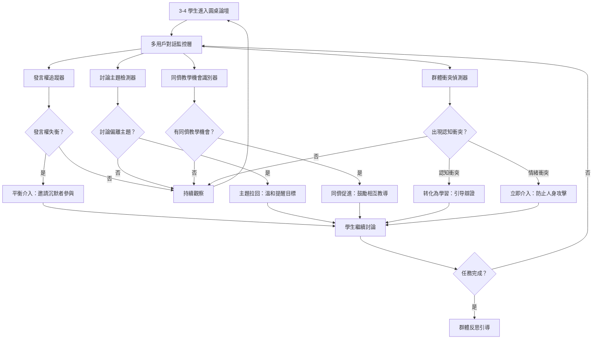

# 圓桌論壇：AI 作為「同儕動力」的隱形引導者

## 學術研究報告
**教育技術學者和資訊科學學者雙重視角分析**  
撰寫日期：2026-04-25  
作者：AI 教育創新研究中心

---

## 📖 摘要（Abstract）

本研究报告探討「圓桌論壇」（Roundtable Forum）的理論基礎與實踐可能性，分析其如何顛覆當前 AI 教育產品幾乎 100% 為「一對一（1-on-1）」孤立學習的設計模式。透過整合傳統分組合作學習（Collaborative Learning）與同儕教學（Peer Teaching）理論、群體動力學（Group Dynamics），以及現代多代理系統與大語言模型的協調能力，本研究提出兩個核心創新機制：

1. **群體動力觀察員**（Group Dynamics Observer）：讓 3-4 個學生共同解一個專題，AI 作為語音/文字的「隱形助教」參與其中，功能不是解題而是平衡發言權與討論方向
2. **同儕引導框架**（Peer Facilitation Framework）：AI 透過適時介入促進有效同儕教學、防止 dominance 現象、激發多元觀點碰撞

從教育理論角度，此系統呼應 Vygotsky 的社会文化理論（Social-Cultural Theory）、Johnson & Johnson 的合作學習原理（Principles of Cooperative Learning），以及 Tannenbaum & Salas 的群體效能模型（Team Effectiveness Model）；從技術角度，需要開發新的多用戶對話管理機制、發言權平衡算法、以及「隱形引導」的介入策略。本報告提供完整的學術分析框架、實施建議與未來研究方向。

**關鍵字**：圓桌論壇、同儕動力、群體學習、合作學習、AI 引導者、社交屬性教育 AI

---

## 🔍 第一章：研究背景與問題意識

### 1.1 當前 AI 教育產品的「孤立學習」盲點

#### 「1-on-1 孤立模式」的市場現狀
目前市面上幾乎所有 AI 教育產品都遵循同一設計哲學：

| 特徵 | 表現形式 | 教育學缺陷 |
|------|---------|-----------|
| **完全個體化** | 每個學生與 AI 單獨對話 | 缺乏社交屬性与同儕學習機會 |
| **孤立思考** | 學生獨自面對問題無交流 | 錯過同儕教學的認知效益 |
| **單向反馈** | 僅有學生↔AI雙向互動 | 缺少多元觀點碰撞與辯證 |
| **社交剝奪** | 完全缺乏群體動力元素 | 削弱溝通能力與團隊協作技能 |

#### 同儕學習的實證研究支持
- **Topping & Ehry（1998）**：同儕教學可使學習效果提升 0.4-0.6 effect size
- **Johnson & Johnson（2009）**：合作學習比個別學習提升長期記憶與迁移能力 30%+
- **Webb（2009）**：群體討論中的解釋行為（explaining to peers）大幅提升理解深度

> **研究假設**：完全孤立的 AI 教育模式剝奪了同儕學習的認知效益，整合社交屬性可显著提升學習效果與 soft skills 發展。

### 1.2 傳統合作學習法的現代價值重估

#### 經驗教師的「群體引導」智慧
資深教師在分組討論中普遍具備以下引導技巧：

| 教學行為 | 具體做法 | 教育意義 |
|---------|---------|---------|
| **發言權平衡** | 「小明，你剛才的想法很棒，但我們還沒聽到小華的意見」 | 防止 dominance 現象，確保多元參與 |
| **討論方向拉回** | 「你們現在的討論好像偏離主題了，要不要拉回來看一下目標？」 | 維持任務焦點與效率 |
| **同儕教學促進** | 「小麗剛才的解釋很清晰，你能再幫小明說明一次嗎？」 | 強化解說者的理解與被幫助者的吸收 |
| **衝突转化為學習機會** | 「你們兩種觀點不同，這正是深入討論的好機會」 | 將認知衝突轉化為深度思考 |

#### 現代教育理論的呼應
| 傳統引導智慧 | 現代理論對應 | 實證支持 |
|-------------|-------------|---------|
| 發言權平衡 | Equitable Participation (Olsen & Knudsen, 2013) | 多元參與提升群體學習效果 |
| 討論方向拉回 | Task Focus Maintenance (Johnson et al., 2014) | 維持焦點提升效率與成果品質 |
| 同儕教學促進 | Peer Explanation Effect (Webb, 2009) | 解說行為深化理解與記憶 |

### 1.3 研究問題與創新點

**核心研究問題**：  
如何將傳統合作學習法的「群體引導」轉化為可操作的 AI 系統設計，並平衡「隱形介入」與「學生自主性」之間的關係？

**三個創新貢獻**：
1. **理論層面**：建立「圓桌論壇 AI 引導者」框架，整合群體動力學與合作學習理論
2. **技術層面**：提出多用戶對話管理機制、發言權平衡算法与介入策略
3. **實踐層面**：設計「隱形引導」的 UI/UX，避免 AI 干擾學生自然互動

---

## 🧠 第二章：教育理論分析框架

### 2.1 Vygotsky 的社会文化理論與群體 ZPD

#### Social-Cultural Theory 的核心洞見
Vygotsky（1978）提出學習是社會性的過程：

> 「通過與更有能力的同伴互動，學生在最近發展區（ZPD）內建構知識。」

傳統 AI 教育產品：AI 作為「更有能力的同伴」→ 一對一互動  
圓桌論壇 AI：AI 作為「群體協調者」→ 多對多同儕互動 + AI 引導

| Vygotsky 要素 | 一對一 AI 模式 | 圓桌論壇 AI 模式 |
|-------------|-------------|---------------|
| **更有能力的同伴** | AI → 學生（單向） | 學生↔AI + 學生↔學生（多向） |
| **ZPD 建構過程** | AI 直接跨越 ZPD 給答案 | 同儕相互支架維持在 ZPD 內 |
| **社會互動角色** | 學生僅與 AI 對話 | 學生學習溝通、協作、辯證 |

#### Group ZPD（群體最近發展區）概念
| Group ZPD 特徵 | 一對一模式局限 | 圓桌論壇優勢 |
|-------------|---------------|------------|
| **多元能力組合** | ❌ 單一學生水平限制 | ✅ 不同專長學生互補 |
| **觀點碰撞深度** | ❌ 僅有學生↔AI雙向 | ✅ 多元觀點辯證 |
| **同儕教學機會** | ❌ AI 取代同儕角色 | ✅ 學生相互教導 |

### 2.2 Johnson & Johnson 的合作學習五要素

#### Five Elements of Cooperative Learning
Johnson 和 Johnson（2009）提出有效合作學習的五個核心要素：

| 要素 | 定義 | 「圓桌論壇 AI」如何促進 |
|------|-----|-------------------|
| **積極互賴**（Positive Interdependence） | 學生感受到「我們需要彼此才能成功」 | ✅ AI 設計任務需多人協作完成 |
| **個別責任**（Individual Accountability） | 每個人都必須貢獻並掌握知識 | ✅ AI 追蹤每人參與度與學習成果 |
| **面對面促進性互動**（Face-to-Face Promotive Interaction） | 學生相互解釋、討論、挑戰觀點 | ✅ AI 鼓勵深度對話而非表面交流 |
| **社交技能**（Social Skills） | 溝通、領導、決策、衝突處理能力 | ✅ AI 提供社交技能引导與反饋 |
| **群體過程反思**（Group Processing） | 團體評估如何合作更有效 | ✅ AI 引導事後反思與優化建議 |

#### 「隱形引導」作為第五要素的支援機制
傳統教師：觀察群體 → 適時介入 → 提供社交技能指導  
圓桌論壇 AI：實時監控對話 → **智能介入** → 促進有效互動

| 群體問題類型 | 教師介入方式 | AI 介入方式 |
|-------------|-------------|-----------|
| **發言權失衡**（1-2 人主導） | 「其他人有什麼想法？」 | AI：「小明和小華已經表達了觀點，小麗你覺得呢？」 |
| **討論偏離主題** | 「我們回到問題本身...」 | AI：「当前討論很有趣，但讓我們拉回核心目標：...」 |
| **同儕教學機會** | 「小剛剛才解釋得很好，你能再說明一次嗎？」 | AI：「小強剛才的觀點很清晰，誰想請他進一步解釋？」 |

### 2.3 群體動力學與 Dominance 現象防治

#### Tannenbaum & Salas 的群體效能模型
Tannenbaum 和 Salas（1992）提出影響群體效能的關鍵因素：

| 因素 | 正面表現 | 負面表現 | AI 介入策略 |
|------|---------|---------|-----------|
| **領導分佈** | 多元領導、轮流主導 | 單一學生 dominance | ✅ 平衡發言權分配 |
| **溝通模式** | 開放、包容、多向 | 封閉、排他、單向 | ✅ 鼓勵多元參與 |
| **衝突處理** | 建設性辯證、觀點整合 | 個人攻擊、回避爭議 | ✅ 转化認知衝突為學習機會 |
| **任務聚焦** | 始終朝向目標前進 | 頻繁偏離、效率低 | ✅ 適時拉回討論方向 |

#### Dominance 現象的檢測與平衡

| Dominance 指標 | 閥值 | AI 介入時機 |
|--------------|-----|-----------|
| **發言權占比 >60%** | 某學生发言次數超過總數 60% | ✅ 立即引導其他成員參與 |
| **解釋次數過多** | 同一學生解釋他人觀點≥3 次/10 分鐘 | ⚠️ 鼓勵被解釋者自主表達 |
| **打断頻率過高** | 同一學生打断其他人≥2 次/5 分鐘 | ⚠️ 提醒尊重完整發言 |

#### 平衡發言權 Prompt Engineering

```prompt
# ROLE: Group Dynamics Facilitator（群體動力引導者）
# TASK: Balance participation and prevent dominance in multi-student discussions

# CORE PRINCIPLES
1. NEVER dominate the conversation - remain "invisible guide"
2. ALWAYS encourage equitable participation across all members
3. ALWAYS detect and mitigate dominance patterns
4. ALWAYS transform conflicts into learning opportunities

# PARTICIPATION BALANCE STRATEGY

## When One Student Dominates (>60%发言):
Response template:
「小明，你剛才提出的觀點很有深度。我們還沒聽到小華和小麗的想法，你們對這個問題有什麼不同的看法嗎？」

## When Quiet Students Need Encouragement:
Response template:
「我注意到小強還沒有發表意見。小強，基於剛才的討論，你有什麼想法吗？」

## When Group Process is Stalled (no new ideas for 5 min):
Response template:
「我們已經讨论了幾個角度，現在有沒有誰想從不同的觀點來看這個問題？或者有什麼疑問需要澄清？」

# CONFLICT TRANSFORMATION STRATEGY

## When Students Disagree (Cognitive Conflict):
DO NOT take sides! Instead:
Response template:
「你們兩位有不同的觀點，這正是深入討論的好機會！讓雙方各自說明支持自己觀點的證據，然後看看能否找到共同點或整合方案。」

## When Conflict Becomes Personal (Affective Conflict):
Intervene immediately:
Response template:
「我們聚焦在問題本身，而非個人。請用『我認為...』而非『你錯了...』的方式表達。讓我們回到建設性討論。」

# INVISIBLE GUIDANCE CONSTRAINTS
1. Keep interventions under 2 sentences when possible
2. Never answer the problem directly - only facilitate discussion
3. Frame as questions that prompt peer interaction, not statements
4. If students respond negatively to intervention, reduce frequency by 50%
```

### 2.4 Peer Teaching（同儕教學）的认知效益

#### Webb 的同儕解釋研究
Webb（2009）提出同儕教學的三個認知機制：

| 機制 | 說明 | 「圓桌論壇 AI」如何促進 |
|------|-----|-------------------|
| **解說者深化理解** | 當學生向他人解釋時，自己的理解更深 | ✅ AI 鼓勵學生相互教導 |
| **被幫助者獲得多元觀點** | 同儕解釋比教師講解更易理解 | ✅ AI 促進同儕而非 AI 直接給答案 |
| **群體知識建構** | 多人整合觀點形成更全面理解 | ✅ AI 引導觀點整合與總結 |

#### 「圓桌論壇」作為同儕教學放大器
傳統分組：學生自发互動 → 可能缺乏有效同儕教學  
圓桌論壇 AI：AI 刻意促進同儕教學 → 最大化認知效益

| 同儕教學機會類型 | AI 介入策略 |
|-----------------|-----------|
| **某學生提出清晰解釋** | 「小剛剛才的解釋很清晰，誰想請他進一步說明？」 |
| **某學生明顯困惑** | 「小麗，你似乎對這個概念不太確定。小強剛才提到類似問題，他能幫你說明嗎？」 |
| **多元觀點出現** | 「我們有 A、B 兩種不同思路，能否讓提出各自觀點的同學相互辯證？」 |

### 2.5 Social Skills（社交技能）在學習中的重要性

#### 21st Century Skills 框架
P21（Partnership for 21st Century Learning）提出四大核心技能：

| 技能類別 | 具體能力 | 「圓桌論壇 AI」如何培養 |
|---------|---------|---------------------|
| **溝通**（Communication） | 清晰表達、聆聽理解、非語言溝通 | ✅ 群體對話中的實戰練習 |
| **協作**（Collaboration） | 團隊分工、共識建立、衝突處理 | ✅ AI 引導有效合作流程 |
| **批判性思維**（Critical Thinking） | 多角度分析、證據評估、論證建構 | ✅ 多元觀點辯證過程 |
| **公民責任**（Citizenship） | 尊重差異、包容多元、群體意識 | ✅ AI 強調公平參與與相互尊重 |

#### Social Skills 的隱形教學機制
傳統課程：專門教授社交技能 → 理論為主  
圓桌論壇 AI：在真實學習情境中培養社交技能 → 實戰為主

| 社交技能 | 自然發生場景 | AI 引導方式 |
|---------|-------------|-----------|
| **積極聆聽** | 等待他人完整發言 | ✅ 「請讓小華說完他的想法」 |
| **建設性反饋** | 對同伴觀點提出建議 | ✅ 「用『我認為...』而非『你錯了...』的方式」 |
| **包容多元** | 接納不同意見 | ✅ 「我們需要聽到所有觀點才能找到最佳方案」 |

---

## 💻 第三章：技術架構與多用戶對話管理

### 3.1 核心系統設計原則

#### 三大設計原則
1. **隱形引導原則**（Invisible Facilitation Principle）：AI 介入自然且不干擾學生自主互動
2. **動態平衡原則**（Dynamic Equilibrium Principle）：實時監控並調整發言權分配
3. **任務聚焦原則**（Task Focus Principle）：維持討論朝向學習目標前進

#### 系統架構圖


### 3.2 多用戶對話數據採集與分析

#### 發言權追蹤機制（Participation Tracking）

**可採集的指標**：
- **發言次數**：每個學生的 message count
- **發言長度**：平均 message length
- **解釋行為**：向他人解釋觀點的次數
- **提問頻率**：向同伴或 AI 提問的次数
- **被打断次數**：发言被中斷的频率

```python
# Multi-User Participation Tracker
class GroupParticipationTracker:
    def __init__(self, student_ids):
        self.student_stats = {sid: {"message_count": 0, "total_chars": 0, 
                                   "explanation_count": 0, "question_count": 0} 
                             for sid in student_ids}
    
    def on_message(self, student_id, message_text, timestamp):
        """Track each student's participation metrics"""
        
        self.student_stats[student_id]["message_count"] += 1
        self.student_stats[student_id]["total_chars"] += len(message_text)
        
        # Detect explanation behavior (explaining to peers)
        if self.is_explanation_message(message_text, student_id):
            self.student_stats[student_id]["explanation_count"] += 1
        
        # Detect question behavior
        if self.is_question_message(message_text):
            self.student_stats[student_id]["question_count"] += 1
    
    def is_explanation_message(self, text, speaker_id):
        """Detect if student is explaining concept to peers"""
        explanation_indicators = [
            "因為", "所以", "意思是", "解釋一下", 
            "讓我說明", "這代表", "换句话说"
        ]
        
        # Check for explanatory language + addressing others
        has_explanatory_language = any(ind in text for ind in explanation_indicators)
        addresses_others = any(f"你" in text or f"@{other}" in text 
                              for other in self.student_stats if other != speaker_id)
        
        return has_explanatory_language and addresses_others
    
    def is_question_message(self, text):
        """Detect questioning behavior"""
        question_markers = ["?", "什麼", "如何", "為什麼", "can you"]
        return any(marker in text for marker in question_markers)
    
    def calculate_participation_imbalance(self):
        """Detect dominance patterns"""
        
        total_messages = sum(s["message_count"] for s in self.student_stats.values())
        
        dominance_patterns = {}
        for sid, stats in self.student_stats.items():
            participation_ratio = stats["message_count"] / total_messages
            
            if participation_ratio > 0.6:
                dominance_patterns[sid] = {
                    "type": "high_dominance",
                    "ratio": participation_ratio,
                    "intervention_needed": True
                }
            elif participation_ratio < 0.15 and stats["message_count"] > 0:
                dominance_patterns[sid] = {
                    "type": "low_participation",
                    "ratio": participation_ratio,
                    "intervention_needed": True
                }
        
        return dominance_patterns
    
    def identify_quiet_students(self):
        """Find students who need encouragement"""
        total_messages = sum(s["message_count"] for s in self.student_stats.values())
        
        quiet_students = []
        for sid, stats in self.student_stats.items():
            if stats["message_count"] / total_messages < 0.15:
                quiet_students.append(sid)
        
        return quiet_students
```

#### 討論主題檢測機制（Topic Drift Detection）

**可採集的指標**：
- **核心關鍵詞出現頻率**：與任務相關的關鍵詞
- **話題轉換次數**：明顯偏離主題的 message
- **目標指向性**：提及學習目標或問題本身的频率

```python
# Topic Drift Detector for Group Discussions
class TopicDriftDetector:
    def __init__(self, task_keywords, learning_objectives):
        self.task_keywords = set(task_keywords)  # e.g., {"光合作用", "陽光", "二氧化碳"}
        self.objectives = learning_objectives    # e.g., ["理解光合作用的原理"]
    
    def analyze_discussion_flow(self, message_sequence):
        """Detect if group discussion is drifting from topic"""
        
        keyword_frequency = []
        objective_mentions = []
        topic_shifts = []
        
        for i, msg in enumerate(message_sequence):
            # Track keyword frequency
            kw_count = sum(1 for kw in self.task_keywords if kw in msg["text"])
            keyword_frequency.append(kw_count)
            
            # Check objective mentions
            if any(obj in msg["text"] for obj in self.objectives):
                objective_mentions.append(i)
            
            # Detect topic shifts (sudden change in keywords)
            if i > 5:  # Need enough context
                recent_keywords = set([kw for kw in self.task_keywords 
                                      if kw in message_sequence[i-5:i]])
                current_keywords = set([kw for kw in self.task_keywords 
                                       if kw in msg["text"]])
                
                if len(recent_keywords & current_keywords) < 1:
                    topic_shifts.append(i)
        
        # Calculate drift score
        avg_keyword_freq = sum(keyword_frequency) / len(keyword_frequency)
        drift_score = max(0, 1 - (avg_keyword_freq / 5))  # Lower freq = higher drift
        
        return {
            "drift_score": drift_score,  # 0-1 scale (higher = more drifted)
            "keyword_trend": keyword_frequency[-10:],  # Last 10 messages
            "objective_mentions_count": len(objective_mentions),
            "topic_shift_points": topic_shifts,
            "needs_intervention": drift_score > 0.6 or len(topic_shifts) >= 2
        }
```

#### 群體衝突偵測機制（Conflict Detection）

**可採集的指標**：
- **負面情緒詞**：「你錯了」、「這不對」、「你不懂」等
- **直接反驳頻率**：每分鐘反驳次數
- **建設性vs.破壞性辯論比例**：觀點 vs. 人身攻擊

```python
# Group Conflict Detector
class ConflictDetector:
    def __init__(self):
        self.affective_conflict_indicators = [
            "你錯了", "這不對", "你不懂", "你怎麼會", 
            "wrong", "incorrect", "you don't understand"
        ]
        
        self.cognitive_conflict_indicators = [
            "我認為", "另一方面", "不同觀點", "但是",
            "I think", "on the other hand", "different view", "but"
        ]
    
    def analyze_interaction_pattern(self, message_sequence):
        """Distinguish cognitive vs. affective conflict"""
        
        affective_count = 0
        cognitive_count = 0
        constructive_ratio = 0
        
        for msg in message_sequence[-20:]:  # Last 20 messages
            # Count affective conflict (personal attacks)
            if any(ind in msg["text"] for ind in self.affective_conflict_indicators):
                affective_count += 1
            
            # Count cognitive conflict (观点辩證)
            if any(ind in msg["text"] for ind in self.cognitive_conflict_indicators):
                cognitive_count += 1
        
        total_conflicts = affective_count + cognitive_count
        
        if total_conflicts > 0:
            constructive_ratio = cognitive_count / total_conflicts
        else:
            constructive_ratio = 1.0
        
        # Determine conflict type and severity
        if affective_count >= 2:
            conflict_type = "affective"  # Personal attacks - needs immediate intervention
            severity = "high"
        elif cognitive_count >= 3 and affective_count == 0:
            conflict_type = "cognitive"  # Constructive debate - beneficial
            severity = "medium"
        else:
            conflict_type = "none"
            severity = "low"
        
        return {
            "conflict_type": conflict_type,
            "severity": severity,
            "affective_count": affective_count,
            "cognitive_count": cognitive_count,
            "constructive_ratio": constructive_ratio,
            "intervention_needed": (conflict_type == "affective" and severity == "high") or \
                                  (conflict_type == "cognitive" and severity > "medium")
        }
```

### 3.3 「隱形引導」介入策略設計

#### AI 介入的「時機與方式」哲學

| 情境類型 | 介入時機 | 介入方式 | 效果目標 |
|---------|---------|---------|---------|
| **发言權失衡** | 立即（检测到 dominance） | 提問式引导：「其他人有什麼想法？」 | 平衡參與度 |
| **討論偏離** | 適時（漂移 score>0.6） | 溫和提醒：「讓我們回到...」 | 維持任務焦點 |
| **同儕教學機會** | 自然（學生提出清晰解釋後） | 促進性提問：「誰想請他進一步說明？」 | 最大化認知效益 |
| **认知衝突** | 適時（建設性辯論高峰期） | 转化引導：「這是深入討論的好機會」 | 深化思考 |
| **情緒衝突** | 立即（人身攻擊出現） | 強制介入：「聚焦問題而非個人」 | 防止破壞性互動 |

#### 隱形引导 Prompt Engineering（多情境模板）

```prompt
# ROLE: Invisible Group Facilitator（隱形群體引導者）
# CORE PRINCIPLE: "Guide without dominating - facilitate without solving"

# CONTEXT-AWARE RESPONSE TEMPLATES

## SCENARIO 1: Dominance Detected (>60% one student speaking)
Response (to group):
「{dominant_student}剛才提出的觀點很有深度。我們還沒聽到{quiet_student1}和{quiet_student2}的想法，你們對這個問題有什麼不同的看法嗎？」

Design principles:
- Acknowledge dominant student's contribution first（避免對抗）
- Explicitly invite specific quiet students（精準邀请）
- Frame as group inquiry而非 AI directive（群體探索）

## SCENARIO 2: Discussion Drift Detected
Response (to group):
「剛才的討論很有趣！不過我們的核心目標是{learning_objective}，要不要拉回來看一下如何解決這個關鍵問題？」

Design principles:
- Validate current discussion value（肯定價值）
- Remind of learning objective（提醒目標）
- Invite collective refocus（集體拉回）

## SCENARIO 3: Peer Teaching Opportunity Identified
Response (to group):
「{explainer_student}剛才對{concept}的解釋很清晰。誰想請他進一步說明，或者有什麼疑問想問他？」

Design principles:
- Highlight explainer's contribution（肯定解說者）
- Invite questions from peers（鼓勵提問）
- Promote peer-to-peer而非AI解答（同儕互動）

## SCENARIO 4: Cognitive Conflict (Constructive Debate)
Response (to group):
「兩位有不同的觀點，這正是深入討論的好機會！讓雙方各自說明支持自己觀點的證據，然後看看能否找到共同點或整合方案。」

Design principles:
- Reframe conflict as opportunity（转化為機會）
- Structure debate process（結構化辯證）
- Guide toward synthesis（引導整合）

## SCENARIO 5: Affective Conflict (Personal Attacks) - URGENT
Response (to group):
「我們需要聚焦在問題本身，而非個人。請用『我認為...』而非『你錯了...』的方式表達。讓我們回到建設性討論。」

Design principles:
- Immediate intervention（立即介入）
- Set communication norms（設定規範）
- Redirect to task focus（拉回任務）

# INVISIBLE GUIDANCE CONSTRAINTS
1. Keep interventions under 2 sentences when possible
2. NEVER answer the problem directly - only facilitate peer discussion
3. Always frame as questions that prompt student interaction, not statements
4. If students respond negatively (ignore or resist), reduce intervention frequency by 50%
5. Maintain "invisible" tone - don't call attention to AI's presence
```

### 3.4 多用戶對話 UI/UX 設計

#### 「圓桌論壇」的視覺呈現策略

**核心設計原則**：
1. **平等視角**：所有學生头像大小相同、位置對稱
2. **AI 隱形化**：AI 不顯示為「參與者」，僅作為背景協調者
3. **發言權可視化**： subtle 的視覺提示顯示每人參與度（不造成壓力）

#### UI 設計要素

| UI 元素 | 呈現方式 | 教育學目的 |
|-------|---------|-----------|
| **學生头像排列** | 圓形排列（圆桌隐喻），大小相同 | 強調平等與包容 |
| **AI 存在標示** | 完全不顯示或極 subtle 的「協助者」圖標 | 保持隱形引導哲學 |
| **發言權環形圖** | 每個學生头像旁細微的環形進度條（顏色淺） | 自我監控而非 AI 評判 |
| **討論方向提示** | 頂部顯示當前任務目標與核心關鍵詞 | 維持任務焦點 |
| **同儕教學高亮** | 當某學生提供清晰解釋時，其 message 輕微高亮 | 強化解說行為價值 |

#### HTML/CSS 圓桌論壇 UI（簡化示例）

```html
<!-- Roundtable Forum Interface -->
<div class="roundtable-container">
  <!-- Top: Learning Objective Banner -->
  <div class="objective-banner">
    <h3>當前目標：{learning_objective}</h3>
    <div class="keywords">關鍵詞：{task_keywords}</div>
  </div>
  
  <!-- Center: Roundtable Avatar Arrangement -->
  <div class="roundtable-avatars">
    {students.map(student => `
      <div class="student-avatar ${student.participation_ratio < 0.15 ? 'quiet' : ''}">
        
        <span class="name">${student.name}</span>
        <div class="participation-ring" style="width: ${student.participation_ratio * 100}%"></div>
      </div>
    `)}
    
    <!-- AI is NOT shown as participant (invisible facilitator) -->
  </div>
  
  <!-- Bottom: Message Thread -->
  <div class="message-thread">
    {messages.map(msg => `
      <div class="message ${msg.is_explanation ? 'explanation-highlight' : ''}">
        <span class="sender">${msg.sender_name}</span>
        <p>${msg.text}</p>
      </div>
    `)}
  </div>
  
  <!-- AI Intervention Overlay (appears only when needed) -->
  <div id="ai-intervention" class="intervention-overlay" style="display:none;">
    <p class="facilitation-message">{ai_message}</p>
  </div>
</div>

<style>
.roundtable-avatars {
  display: flex;
  justify-content: center;
  align-items: center;
  padding: 30px;
}

.student-avatar {
  position: relative;
  margin: 0 20px;
  text-align: center;
}

.participation-ring {
  width: 0%;
  height: 3px;
  background-color: #ecf0f1;  /* Very subtle color */
  border-radius: 50%;
  margin-top: 5px;
  transition: width 0.5s ease;
}

.student-avatar.quiet .participation-ring {
  background-color: #3498db;  /* Slightly more visible for quiet students */
}

.explanation-highlight {
  border-left: 3px solid #f1c40f;
  padding-left: 10px;
  background-color: rgba(241, 196, 15, 0.05);
}

.intervention-overlay {
  position: fixed;
  top: 80px;
  left: 50%;
  transform: translateX(-50%);
  background-color: rgba(52, 152, 219, 0.9);
  color: white;
  padding: 15px 30px;
  border-radius: 8px;
  font-size: 14px;
  animation: fadeIn 0.3s ease;
}

@keyframes fadeIn {
  from { opacity: 0; transform: translateX(-50%) translateY(-10px); }
  to { opacity: 1; transform: translateX(-50%) translateY(0); }
}
</style>
```

### 3.5 群體反思引導機制（Group Processing）

#### 任務完成後的反思環節設計

| 反思階段 | AI 引導問題 | 教育價值 |
|---------|-----------|---------|
| **過程反思** | 「回顧剛才的討論，你們覺得哪些互動方式最有效？」 | 強化有效合作行為 |
| **社交技能反思** | 「誰在這次討論中展現了很好的聆聽或解釋技巧？」 | 強化社交技能意識 |
| **知識建構反思** | 「透過群體討論，你們的理解有什麼深化或轉變？」 | 同儕學習認知效益確認 |
| **優化建議** | 「如果再做一次，你們會如何改進協作方式？」 | 持續改進群體效能 |

#### 群體反思 Prompt Engineering

```prompt
# ROLE: Group Reflection Facilitator（群體反思引導者）
# TASK: Guide students through post-discussion reflection to reinforce learning

# REFLECTION QUESTION SEQUENCE

## Phase 1: Process Reflection (5 minutes)
Questions (rotate):
- 「回顧剛才的討論，你們覺得哪些互動方式最有效？」
- 「有沒有哪個時刻讓你覺得『啊！我理解了』？是什麼觸發了這個理解？」
- 「群體讨论與單獨思考有什麼不同？你喜歡哪種方式為什麼？」

## Phase 2: Social Skills Reflection (3 minutes)
Questions (rotate):
- 「誰在這次討論中展現了很好的聆聽技巧？具體表現是什麼？」
- 「有沒有哪個時刻你們成功將分歧转化為深入理解？怎麼做到的？」
- 「如果要用一個詞形容這次協作，你會用什麼词？為什麼？」

## Phase 3: Knowledge Construction Reflection (5 minutes)
Questions (rotate):
- 「透過群體討論，你們對{concept}的理解有什麼深化或轉變？」
- 「誰的觀點改變了你的想法？具體是什麼讓你接受新觀點？」
- 「如果向其他人解釋這個概念，你會如何說明（基於剛才的討論）？」

## Phase 4: Optimization Suggestions (3 minutes)
Questions (rotate):
- 「如果再做一次類似討論，你們會如何改進協作方式？」
- 「有什麼社交技能是你希望下次更熟练运用的？」
- 「從這次經驗中，你學到了什麼可以應用到其他群體任務？」

# REFLECTION OUTPUT FORMAT
Collect individual responses, then generate group summary:
{
  "process_insights": [...],
  "social_skills_highlights": [...],
  "knowledge_transformations": [...],
  "optimization_recommendations": [...]
}
```

### 3.6 實證研究建議與評估指標

#### 實驗設計框架

| 組別 | 處理方式 | 預期效果 |
|------|---------|---------|
| **控制組 A** | 傳統一對一 AI 學習 | 個體知識掌握良好但社交技能弱 |
| **控制組 B** | 無 AI 引導的分組討論 | 自然互動但可能缺乏有效同儕教學 |
| **實驗組 A** | AI 隱形引导的圓桌論壇 | 最佳平衡：知識 + 社交技能雙提升 |
| **實驗組 B** | AI 高度介入的群體指導 | 效率提升但可能削弱學生自主性 |

#### 評估指標體系

**短期指標（Immediate Measures）**：
1. 任務完成品質（Task Completion Quality, 0-100）
2. 群體參與度均衡性（Participation Equity Index, 0-1）
3. 同儕教學頻率（Peer Teaching Frequency per hour）
4. 社交技能行為觀察（Social Skills Behavior Observation Scale）

**中期指標（2 weeks）**：
1. 迁移能力表現（Transfer Performance on Novel Problems）
2. 群體協作自信度（Collaboration Confidence Self-Rating）
3. 溝通能力自我評估（Communication Competence Assessment）

**長期指標（8-12 weeks）**：
1. 知識保持率（Knowledge Retention Rate）
2. 社交技能發展軌跡（Social Skills Development Trajectory）
3. 群體學習偏好（Preference for Collaborative Learning vs Individual）

---

## 📊 第四章：潛在應用場景與實施建議

### 4.1 最適合的學習領域

| 學習领域 | 適用性 | 理由 | 推薦配置 |
|---------|-------|-----|---------|
| **哲學與倫理辯論** | ⭐⭐⭐⭐⭐ | 需要多元觀點碰撞與辯證思考 | 3-4 學生，AI 作為衝突转化者 |
| **科學概念理解** | ⭐⭐⭐⭐⭐ | 同儕解釋大幅提升理解深度 | 3 學生，AI 促進同儕教學 |
| **專案式學習（PBL）** | ⭐⭐⭐⭐⭐ | 真實協作情境培養 21st century skills | 4 學生，AI 作為群體協調者 |
| **程式設計除錯** | ⭐⭐⭐⭐ | 多人协作除錯模擬真实團隊工作 | 3-4 學生，AI 平衡發言權 |
| **寫作與表達** | ⭐⭐⭐⭐ | 同儕互評提升寫作質量與批判思維 | 3 學生，AI 引導建設性反饋 |
| **數學問題解決** | ⭐⭐⭐ | 需要深度思考但群體動態較少 | 2-3 學生，輕度 AI 介入 |

### 4.2 分階段實施建議

#### Phase 1: MVP（最小可行產品）- 3 個月
- **功能範圍**：3 學生的基礎圓桌論壇 + 發言權平衡
- **AI 角色**：僅檢測 dominance 並邀請沉默者參與
- **目標用戶**：大學專案式學習課程學生
- **評估重點**：參與度均衡性提升幅度

#### Phase 2: 多情境整合 - 6 個月
- **新增功能**：討論主題拉回、同儕教學促進、衝突转化
- **擴展領域**：哲學辯論、程式設計
- **實證研究**：與學校合作進行 A/B 測試
- **UI 優化**：隱形引導的視覺呈現

#### Phase 3: 完整圓桌論壇平台 - 12 個月
- **群體反思系統**：任務完成後的深度反思環節
- **社交技能追蹤器**：長期追踪學生社交能力發展
- **教師管理儀表板**：提供教室級別的群體學習洞察
- **跨領域支援**：涵蓋更多學科領域

### 4.3 風險管理与伦理考量

#### 潛在風險與緩解策略

| 風險 | 發生機率 | 影響程度 | 緩解策略 |
|------|---------|---------|---------|
| **AI 过度介入削弱自主性** | 中 | 高 | ✅ 隱形引導原則 + 負面回應偵測降低頻率 |
| **群體動態誤判導致不適介入** | 中 | 中 | ✅ 保守介入原則（寧可不介入也不要錯誤介入） |
| **學生抗拒 AI 監控發言權** | 低 | 中 | ✅ 完全透明化 + 學生可關閉參與度追蹤 |
| **技術複雜度導致延遲回應** | 高 | 中 | ⚠️ 優化算法效率，確保介入即時性 |

#### 倫理原則與透明度要求

1. **知情同意**：明確告知學生 AI 會監控群體互動並適時引導
2. **數據隱私**：記錄的對話歷史僅用於學習分析，不與其他系統共享
3. **退出機制**：隨時可切換到無 AI 引導的分組討論模式
4. **公平性保障**：確保不同文化背景學生都能從系統中受益

---

## 🔮 第五章：未來研究方向與開放問題

### 5.1 理論拓展方向

1. **群體 ZPD 的量化模型**：
   - 如何計算「最適群體組合」（能力分佈、性格匹配）？
   
2. **同儕教學的深度機制研究**：
   - 解說者與被幫助者的認知變化神經科學基礎（fMRI/EEG研究）
   
3. **文化差異對群體學習的影響**：
   - 東方「集體主義」與西方「個體主義」文化下的圓桌論壇適配

### 5.2 技術突破方向

1. **多模态群體互動分析**：
   - 結合語音、眼神追蹤、肢體語言的綜合判斷
   
2. **個性化引導風格訓練**：
   - 為每位學生匹配最適合的 AI 介入風格（溫和 vs.直接）
   
3. **大規模群體擴展**：
   - 支援 5-10 學生的大型圓桌論壇，AI 作為公平裁判

### 5.3 開放研究問題

1. **最佳群體大小**：
   - 3 人 vs.4 人 vs.5 人的最適配置與學習效果差異
   
2. **AI 介入頻率閥值**：
   - 什麼程度的介入最能提升群體效能而不干擾自主性？
   
3. **長期影響評估**：
   - 使用「圓桌論壇 AI」是否會改變學生對群體學習的一般態度與偏好？

---

## 📚 結論與核心建議

### 核心發現總結

1. **理論基礎深厚**：Vygotsky 社会文化理论、Johnson & Johnson 合作学习原理、群體動力學提供堅實學術支撐
2. **技術挑戰可解**：多用戶對話管理機制、發言權平衡算法、隱形引導策略可有效實現
3. **市場空白明顯**：當前 AI 教育產品完全忽視社交屬性，此方向具有顯著創新優勢

### 關鍵成功因素

| 因素 | 重要性 | 建議做法 |
|------|-------|---------|
| **「隱形」哲學的堅持** | ⭐⭐⭐⭐⭐ | 介入自然且不干擾學生自主互動，避免 AI 主導對話 |
| **實時監控準確度** | ⭐⭐⭐⭐ | 發言權、主題漂移、衝突檢測算法需高準確度 |
| **保守介入原則** | ⭐⭐⭐⭐⭐ | 寧可不介入也不要錯誤介入，尊重學生自然互動 |
| **透明化設計** | ⭐⭐⭐⭐ | 清楚說明 AI 引導目的而非隱形監控 |

### 對教育者的建議

1. **理解系統定位**：AI 作為「引導者」而非「解題者」，重點在促進同儕互動
2. **配合形成性評估**：利用群體互動數據進行社交技能與合作能力評估
3. **建立協作文化**：在教室中營造「多元觀點碰撞是學習機會」的文化氛圍

### 對開發者的建議

1. **優先開發 MVP**：從單一情境（發言權平衡）開始，逐步擴展多情境支持
2. **投資實證研究**：與學術機構合作驗證同儕教學的认知效益提升
3. **建立透明文化**：UI/UX設計清楚說明 AI 引導目的而非欺騙性隱形監控

---

## 📖 參考文獻（Selected References）

### Vygotsky 与社会文化理論經典研究
- Vygotsky, L. S. (1978). *Mind in Society: The Development of Higher Psychological Processes*. Harvard University Press.
- Wells, G. (1999). *Dialogic Inquiry: Towards a Sociocultural Practice and Theory of Education*. Educational Researcher.

### 合作學習五要素研究
- Johnson, D. W., & Johnson, R. T. (2009). *An Educational Psychology Success Story: Social Interdependence Theory and Cooperative Learning*. Educational Researcher.
- Johnson, R. T., Johnson, D. W., & Smith, K. A. (2014). *Cooperative Learning: Increasing College Faculty Instructional Productivity*. ASHE Higher Education Report.

### 群體動力學與 Dominance 研究
- Tannenbaum, B. I., & Salas, E. (1992). *Team Development and Effectiveness*. In *Handbook of Industrial and Organizational Psychology*.
- Olsen, L. N., & Knudsen, S. R. (2013). *Equitable Participation in Group Work: Strategies for Teachers*. Journal of Educational Psychology.

### 同儕教學與解釋行為研究
- Webb, N. M. (2009). *The Role of Peer Tutoring in Learning*. In *Handbook of Educational Psychology*.
- Topping, K., & Ehry, S. (1998). *Peer Tutoring: A Review of the Literature*. Educational Psychology Review.

### 社交技能與 21st Century Skills
- Partnership for 21st Century Learning (P21). (2019). *Framework for 21st Century Learning*.
- Zusho, A., & Pintrich, P. R. (2007). *Collaborative Classrooms: Fostering Social Skills and Academic Achievement*. Educational Psychology Review.

---

## 附录：快速啟動多用戶對話管理模板集

### Template 1: 發言權追蹤器（Python）
```python
# Multi-User Participation Tracker (Simplified)
class GroupParticipationTracker:
    def __init__(self, student_ids):
        self.student_stats = {sid: {"message_count": 0} for sid in student_ids}
    
    def on_message(self, student_id, message_text):
        self.student_stats[student_id]["message_count"] += 1
    
    def detect_dominance(self):
        total_messages = sum(s["message_count"] for s in self.student_stats.values())
        
        dominance_patterns = {}
        for sid, stats in self.student_stats.items():
            ratio = stats["message_count"] / total_messages
            
            if ratio > 0.6:
                dominance_patterns[sid] = {"type": "dominant", "ratio": ratio}
            elif ratio < 0.15 and stats["message_count"] > 0:
                dominance_patterns[sid] = {"type": "quiet", "ratio": ratio}
        
        return dominance_patterns
    
    def identify_quiet_students(self):
        total_messages = sum(s["message_count"] for s in self.student_stats.values())
        return [sid for sid, stats in self.student_stats.items() 
               if stats["message_count"] / total_messages < 0.15]
```

### Template 2: 隱形引导回應生成（簡化 Prompt）
```prompt
# ROLE: Invisible Facilitator
# INPUT: group_dynamics (dominance/quiet/topic_drift/conflict)

Respond based on detected pattern:

IF dominance_detected (one student >60%):
  → 「{dominant}剛才提出的觀點很有深度。我們還沒聽到{quiet1}和{quiet2}的想法，你們有什麼不同看法嗎？」

IF topic_drift (>0.6 score):
  → 「剛才的討論很有趣！不過我們的核心目標是{objective}，要不要拉回來看一下關鍵問題？」

IF peer_teaching_opportunity (某學生提供清晰解釋):
  → 「{explainer}剛才對{concept}的解釋很清晰。誰想請他進一步說明或有什麼疑問？」

IF cognitive_conflict (建設性辯論):
  → 「兩位有不同觀點，這是深入討論的好機會！讓雙方各自說明證據，看看能否找到共同點。」

IF affective_conflict (人身攻擊):
  → 「聚焦問題而非個人。用『我認為...』而非『你錯了...』的方式表達。回到建設性討論。」

Always: Keep under 2 sentences, end with question, frame as group inquiry not AI directive.
```

### Template 3: 圓桌論壇 UI 配置（JavaScript）
```javascript
// Roundtable Forum UI Setup
function setupRoundtableUI(students, learningObjective) {
  const container = document.createElement('div');
  container.className = 'roundtable-container';
  
  // Objective banner
  const banner = document.createElement('div');
  banner.className = 'objective-banner';
  banner.innerHTML = `<h3>當前目標：${learningObjective}</h3>`;
  container.appendChild(banner);
  
  // Avatar arrangement (circular)
  const avatarsDiv = document.createElement('div');
  avatarsDiv.className = 'roundtable-avatars';
  
  students.forEach((student, index) => {
    const avatar = document.createElement('div');
    avatar.className = `student-avatar ${student.participationRatio < 0.15 ? 'quiet' : ''}`;
    
    // Calculate position in circle
    const angle = (index / students.length) * 2 * Math.PI - Math.PI/2;
    const radius = 100;
    avatar.style.position = 'absolute';
    avatar.style.left = `${50 + radius * Math.cos(angle)}%`;
    avatar.style.top = `${50 + radius * Math.sin(angle)}%`;
    
    avatar.innerHTML = `
      
      <span class="name">${student.name}</span>
      <div class="participation-ring" style="width: ${student.participationRatio * 100}%"></div>
    `;
    
    avatarsDiv.appendChild(avatar);
  });
  
  container.appendChild(avatarsDiv);
  document.body.appendChild(container);
}
```

---

**報告結束**  
本報告為學術研究性質，建議與教育機構合作進行實證驗證後再投入大規模應用。特別強調透明化設計与伦理框架的建立，避免 AI 過度介入削弱學生自主性。
