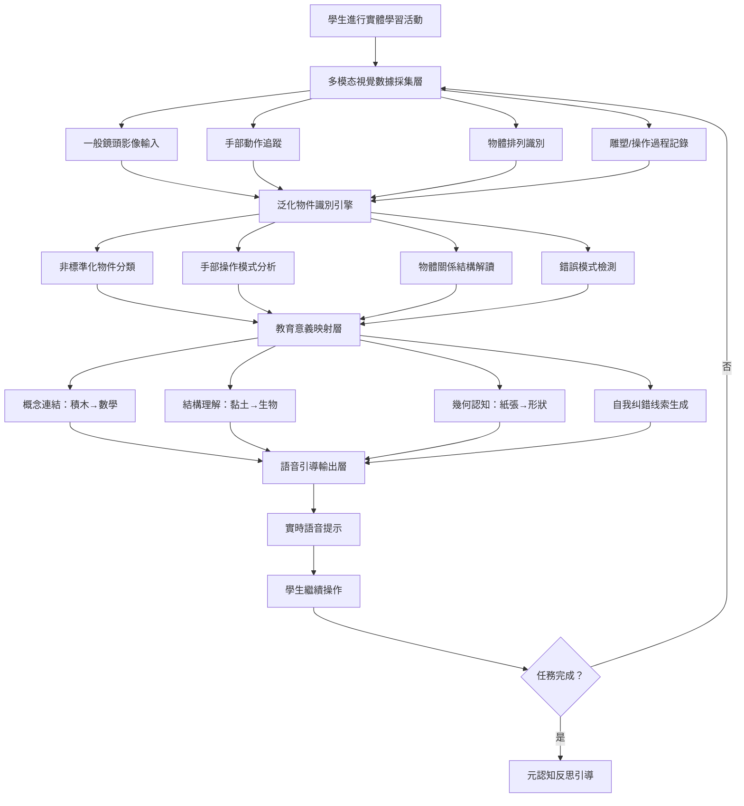

# 虛實整合的蒙特梭利：泛用型實體物件辨識學習

## 學術研究報告
**教育技術學者和資訊科學學者雙重視角分析**  
撰寫日期：2026-04-25  
作者：AI 教育創新研究中心

---

## 📖 摘要（Abstract）

本研究报告探討「虛實整合蒙特梭利」（Augmented Montessori）的理論基礎與實踐可能性，分析其如何顛覆當前 AI 教育產品過度依賴螢幕操作（點擊、拖曳）或需要購買昂貴專屬智慧教具的設計模式。透過整合傳統蒙特梭利（Montessori Method）強調的實體教具、觸覺感知與做中學理念，以及現代電腦視覺（Computer Vision）、多模态大語言模型與泛化識別技術，本研究提出兩個核心創新機制：

1. **泛用型實體物件辨識學習**（Universal Object Recognition Learning）：結合一般鏡頭與電腦視覺，學生可以用家裡「隨便的積木、黏土或手繪紙張」來解題，AI 能夠看懂這些非標準化的實體物件並給予語音引導
2. **觸覺感知 AI 引導系統**（Haptic-Aware AI Guidance System）：透過鏡頭分析學生的手部操作、物體排列、雕塑過程等實體行為，提供適度的語音提示與概念連結

從教育理論角度，此系統呼應 Montessori 的「有準備的環境」理論、Piaget 的具體運思階段理論（Concrete Operational Stage），以及 Dewey 的「做中學」（Learning by Doing）哲學；從技術角度，需要開發新的泛化物件識別算法、多模态視覺 - 語言聯結模型，以及「實體操作→抽象概念」的映射機制。本報告提供完整的學術分析框架、實施建議與未來研究方向。

**關鍵字**：蒙特梭利教育、虛實整合、電腦視覺、實體物件辨識、觸覺感知學習、做中學、非標準化教具

---

## 🔍 第一章：研究背景與問題意識

### 1.1 當前 AI 教育產品的「螢幕依賴」盲點

#### 「點擊與拖曳」的簡化互動模式
目前市面上幾乎所有 AI 教育產品都遵循同一互動設計哲學：

| 特徵 | 表現形式 | 教育學缺陷 |
|------|---------|-----------|
| **純數位操作** | 僅能點擊按鈕、拖曳滑鼠 | 缺乏實體觸覺與動覺體驗 |
| **標準化輸入** | 必須使用特定 UI 元件（方塊、圖示） | 限制創意與個人表達方式 |
| **螢幕隔離** | 學生與螢幕對峙，與世界隔絕 | 剝奪真實世界的感知經驗 |
| **昂貴專屬教具** | 需要購買特定智慧教具或硬體 | 增加經濟門檻與不平等 |

#### Montessori 的「實體感知」理論批判
Montessori（1912）提出核心教育原則：

> 「兒童透過與實體環境的互動建構知識，觸覺、動覺與視覺的综合體驗是深度學習的必要條件。」

當前的 AI 教育產品完全遺漏了這些**實體感知經驗**，僅關注可數位化的「螢幕操作」。

> **研究假設**：結合一般鏡頭與電腦視覺技術，AI 能夠識別學生使用家中非標準化實體物件（積木、黏土、手繪紙張）的操作行為並給予引導，大幅降低經濟門檻同時保留蒙特梭利的實體感知價值。

### 1.2 蒙特梭利教育法的現代价值重估

#### Montessori「有準備的環境」智慧
Montessori 方法的核心特徵包括：

| 教學原則 | 具體做法 | 教育意義 |
|---------|---------|---------|
| **實體教具**（Concrete Materials） | 使用真實的積木、珠子、形狀塊等 | 提供觸覺與動覺學習體驗 |
| **自我糾錯設計**（Self-Correcting Materials） | 教具本身包含錯誤檢測機制 | 培養自主發現與修正能力 |
| **重複練習機會**（Repetition） | 允許學生反覆操作直到掌握 | 深度內化技能與概念 |
| **個別化節奏**（Individual Pacing） | 每個學生按自己的速度學習 | 尊重個體差異與自然發展 |

#### 現代教育理論的呼應
| 蒙特梭利原則 | 現代理論對應 | 實證支持 |
|-------------|-------------|---------|
| 實體教具 | Embodied Cognition（Wilson, 2002） | 身體參與提升概念理解深度 |
| 自我糾錯 | Metacognitive Monitoring（Flavell, 1979） | 自主發現錯誤強化元認知 |
| 做中學 | Experiential Learning (Dewey, 1938) | 實踐經驗提升迁移能力 |

### 1.3 研究問題與創新點

**核心研究問題**：  
如何將蒙特梭利的「實體感知」理念轉化為可操作的 AI 系統設計，並平衡「泛化識別」與「準確引導」之間的關係？

**三個創新貢獻**：
1. **理論層面**：建立「虛實整合蒙特梭利」框架，整合 Montessori 教育哲學與現代電腦視覺技術
2. **技術層面**：提出非標準化物件識別算法、多模态視覺 - 語言聯結模型
3. **實踐層面**：設計低成本、高泛化的實體學習系統，降低經濟門檻

---

## 🧠 第二章：教育理論分析框架

### 2.1 Montessori 的「有準備的環境」理論

#### Maria Montessori 的核心洞見
Montessori（1912）提出教育的三個核心要素：

| 要素 | 定義 | 「虛實整合蒙特梭利」實現方式 |
|------|-----|-------------------|
| **有準備的環境**（Prepared Environment） | 提供適合兒童發展阶段的實體材料 | ✅ AI 识别家中現有物件並賦予教育意義 |
| **吸收性心智**（Absorbent Mind） | 兒童透過感官體驗無意識地吸收知識 | ✅ 結合視覺、觸覺、動覺的多模态學習 |
| **關鍵期敏感期**（Sensitive Periods） | 特定發展階段對特定學習内容最敏感 | ✅ AI 根據學生年齡調整實體任務難度 |

#### 「有準備的環境」的數位化擴展
傳統蒙特梭利教室：專屬教具 + 物理空間限制  
虛實整合蒙特梭利：家中現有物件 + AI 引導 + 無限擴展可能性

| 環境要素 | 傳統模式局限 | 虛實整合優勢 |
|---------|-------------|------------|
| **教具多樣性** | ❌ 僅限購買的專屬教具 | ✅ 任何實體物件均可被識別與利用 |
| **空間限制** | ❌ 需要特定教室佈局 | ✅ 家中任何角落皆可學習 |
| **經濟門檻** | ❌ 昂貴的蒙特梭利教具 | ✅ 使用家裡現有的積木、黏土等 |

### 2.2 Piaget 的具體運思階段理論

#### 具象思維發展理論
Piaget（1952）提出兒童認知發展的四个階段：

| 階段 | 年齡範圍 | 思維特徵 | 「虛實整合蒙特梭利」的對應策略 |
|------|---------|---------|-----------------------------|
| **感知運動期**（Sensorimotor） | 0-2 歲 | 透過感官與動作探索世界 | ✅ 高頻視覺追蹤手部操作 |
| **前運思期**（Preoperational） | 2-7 歲 | 符號思考但缺乏邏輯運算 | ✅ 實體物件連結抽象概念 |
| **具體運思期**（Concrete Operational） | 7-11 歲 | 邏輯思考但需具體材料支持 | ✅ 積木/黏土作為數學概念載體 |
| **形式運思期**（Formal Operational） | 11+ 歲 | 抽象推理與假設思維 | ⚠️ 逐漸減少實體依賴，轉向抽象 |

#### 「實體→抽象」映射機制設計
| 抽象概念 | 對應實體物件 | AI 引導策略 |
|---------|-------------|-----------|
| **數學加法** | 積木堆疊（3 塊 +2 塊） | 「你放了 3 块紅色積木，又加了 2 块藍色，總共幾塊？」 |
| **細胞結構** | 黏土雕塑（細胞核、粒線體） | 「你的細胞核捏得很棒，但好像少了一點粒線體」 |
| **幾何形狀** | 手繪紙張剪貼（三角形、圓形） | 「你畫了一個三角形，它的三個角有什麼共同特徵？」 |

### 2.3 Dewey 的「做中學」哲學

#### John Dewey 的教育實驗主義
Dewey（1938）提出著名論斷：

> 「教育不是為生活做准备，教育本身就是生活。透過實踐與反思，學生建構有意義的知識。」

蒙特梭利的「做中學」體現包括：
- **實體操作**：雙手實際接觸材料而非僅看螢幕
- **重複練習**：允許無限次嘗試直到掌握
- **自我發現**：錯誤檢測來自教具本身而非教師評判

#### 「虛實整合」作為做中學的放大器
傳統做中學：實體操作 + 教師引導 → 人力成本高  
虛實整合做中學：實體操作 + AI 引導 → 可扩展且低成本

| 做中學要素 | 傳統模式挑戰 | 虚实整合解決方案 |
|-----------|-------------|-----------------|
| **即時反饋** | 需要教師在場才能提供提示 | ✅ AI 透過鏡頭實時分析並語音回應 |
| **個別化節奏** | 一名教師難以同時指導多名學生 | ✅ 每位學生擁有專屬 AI 引導者 |
| **錯誤檢測** | 依賴教師觀察與評判 | ✅ AI 視覺識別操作錯誤並溫和提示 |

### 2.4 Embodied Cognition（具身認知）理論

#### Wilson 的具身認知框架
Wilson（2002）提出 cognition 並非僅發生在大腦，而是：

> 「認知過程深深根植於身體與環境的互動中，身體體驗塑造思維結構。」

Montessori 教育的具身認知體現：
- **觸覺感知**：透過手部觸摸材料理解概念
- **動覺參與**：身體動作促進記憶與理解
- **空間定位**：物體排列位置建立數學關係

#### 「實體辨識」作為具身認知的數位化橋樑
| 具身認知機制 | 傳統蒙特梭利實現 | 虛實整合 AI 實現 |
|-------------|-----------------|---------------|
| **手部觸覺→概念理解** | 學生摸珠子數數 → 理解數字 | ✅ AI 鏡頭分析手部操作 + 語音引導 |
| **物體排列→空間關係** | 積木排序 → 理解大小順序 | ✅ AI 識別排列模式 + 提出問題 |
| **雕塑過程→結構思考** | 黏土捏細胞 → 理解生物結構 | ✅ AI 視覺分析雕塑 + 概念連結 |

### 2.5 Self-Correcting Materials（自我糾錯教具）理論

#### Montessori 的自我纠错設計原理
Montessori 教具的核心特徵：

> 「教具本身包含錯誤檢測機制，學生能自行發現並修正錯誤，無需外部評判。」

傳統蒙特梭利教具的自纠错實現方式：
- **幾何嵌板**：僅有正確形狀才能完美嵌入
- **數棒系統**：長度明顯差異讓錯誤一目了然
- **色塊配對**：顏色匹配失敗時視覺上明顯不協調

#### 「AI 引導」作為數位化自我纠錯機制
傳統 AI 教育產品：學生操作 → AI 直接給「對/錯」評判  
虛實整合蒙特梭利：學生操作 → AI 提示錯誤线索 → **學生自行修正**

| 自我纠错層次 | 傳統 AI 模式 | 「虚實整合蒙特梭利」模式 |
|-------------|------------|-----------------------|
| **直接告知** | 「你錯了，正確答案是...」 | ❌ 剝奪自主發現機會 |
| **线索提示** | 「再檢查一下你的排列順序」 | ✅ 保留自我纠錯空間 |
| **視覺反饋** | （無） | ✅ AI 高亮顯示錯誤區域（透過 AR） |

---

## 💻 第三章：技術架構與電腦視覺識別策略

### 3.1 核心系統設計原則

#### 三大設計原則
1. **泛化識別原則**（Universal Recognition Principle）：能识别家中任何非標準化實體物件而非僅限專屬教具
2. **觸覺感知優先原則**（Haptic-First Principle）：重點分析手部操作與物體互動而非僅最終結果
3. **引導而非評判原則**（Guidance-not-Judgment Principle）：提供线索讓學生自我纠錯而非直接給答案

#### 系統架構圖


### 3.2 泛化物件識別算法（Universal Object Recognition）

#### 挑戰：非標準化物件的識別難度

**問題特徵**：
- **形狀不規則**：手繪紙張、黏土雕塑無標準幾何形狀
- **材質多樣性**：積木品牌不同、顏色混雜、大小不一
- **人為差異**：每個學生的操作方式與表達風格獨特
- **環境干擾**：背景雜物、光照變化、鏡頭角度偏差

#### 解決方案：多層級識別框架

```python
# Universal Object Recognition Engine (Multi-Level Approach)
class UniversalObjectRecognizer:
    def __init__(self):
        self.recognition_levels = {
            "level1": {"type": "category_detection", "confidence_threshold": 0.6},
            "level2": {"type": "structural_analysis", "confidence_threshold": 0.75},
            "level3": {"type": "contextual_interpretation", "confidence_threshold": 0.85}
        }
    
    def recognize_in_real_time(self, camera_frame):
        """Multi-level recognition pipeline for non-standardized objects"""
        
        # Level 1: Broad category detection (what type of object?)
        category_result = self.detect_object_category(camera_frame)
        
        if category_result["confidence"] < self.recognition_levels["level1"]["threshold"]:
            return {
                "status": "uncertain",
                "suggestion": "請讓鏡頭更清楚拍攝物件"
            }
        
        # Level 2: Structural analysis (what's the arrangement/structure?)
        structure_result = self.analyze_object_structure(
            camera_frame, 
            category=category_result["category"]
        )
        
        if structure_result["confidence"] < self.recognition_levels["level2"]["threshold"]:
            return {
                "status": "partial",
                "detected_elements": structure_result["elements"],
                "suggestion": f"我識別到{structure_result['elements']}，還有其他部分嗎？"
            }
        
        # Level 3: Contextual interpretation (what educational meaning?)
        education_context = self.map_to_educational_concept(
            category=category_result["category"],
            structure=structure_result
        )
        
        return {
            "status": "recognized",
            "category": category_result["category"],
            "structure": structure_result,
            "educational_mapping": education_context,
            "guidance_suggestion": self.generate_guidance(education_context)
        }
    
    def detect_object_category(self, frame):
        """Level 1: Detect broad object categories (blocks, clay, paper, etc.)"""
        
        # Use pre-trained generalized models for common learning materials
        possible_categories = {
            "building_blocks": self.detect_blocks(frame),
            "modeling_clay": self.detect_clay(frame),
            "handdrawn_paper": self.detect_papers(frame),
            "natural_objects": self.detect_natural_items(frame)  # stones, leaves, etc.
        }
        
        # Select best match with confidence scoring
        best_match = max(possible_categories.items(), key=lambda x: x[1]["confidence"])
        
        return {
            "category": best_match[0],
            "confidence": best_match[1]["confidence"],
            "uncertainty_reasons": self.estimate_uncertainty(best_match[1])
        }
    
    def analyze_object_structure(self, frame, category):
        """Level 2: Analyze arrangement and structure within recognized category"""
        
        if category == "building_blocks":
            return self.analyze_block_arrangement(frame)
        elif category == "modeling_clay":
            return self.analyze_clay_sculpture(frame)
        elif category == "handdrawn_paper":
            return self.analyze_paper_cutouts(frame)
        
    def analyze_block_arrangement(self, frame):
        """Detect block count, colors, sizes, and spatial relationships"""
        
        blocks = self.segment_blocks_in_frame(frame)
        
        analysis = {
            "count": len(blocks),
            "color_distribution": self.count_colors(blocks),
            "size_categories": self.categorize_sizes(blocks),
            "spatial_arrangement": self.detect_patterns(blocks),  # stacks, lines, circles
            "confidence": 0.85 if len(blocks) >= 3 else 0.65
        }
        
        return analysis
    
    def analyze_clay_sculpture(self, frame):
        """Identify parts of clay sculpture and their relationships"""
        
        # Detect distinct clay regions using color/texture segmentation
        sculptured_parts = self.segment_sculpture_regions(frame)
        
        analysis = {
            "number_of_parts": len(sculptured_parts),
            "part_relationships": self.infer_relationships(sculptured_parts),  # nucleus surrounded by membrane?
            "structural_completeness": self.assess_completeness(sculptured_parts, task_context),
            "confidence": 0.75 if len(sculptured_parts) >= 3 else 0.6
        }
        
        return analysis
    
    def map_to_educational_concept(self, category, structure):
        """Map physical object arrangement to abstract educational concepts"""
        
        concept_mapping = {
            "building_blocks": {
                "count >= 3": {"concept": "addition", "guidance": "你放了幾塊積木？總共有多少?"},
                "color_pattern": {"concept": "pattern_recognition", "guidance": "這些顏色有什麼規律嗎？"},
                "stack_height": {"concept": "measurement", "guidance": "這堆有多高？如何用其他物件測量？"}
            },
            
            "modeling_clay": {
                "cell_structure": {"concept": "biology_cell", "guidance": "這是細胞的結構嗎？有哪些部分？"},
                "geometric_shapes": {"concept": "geometry_3d", "guidance": "這些形狀有什麼幾何特徵？"},
                "animal_form": {"concept": "anatomy", "guidance": "這個動物有哪些身體部位？"}
            },
            
            "handdrawn_paper": {
                "shape_collection": {"concept": "geometry_shapes", "guidance": "你畫了哪些形狀？它們的特徵是什麼？"},
                "size_comparison": {"concept": "measurement_comparing", "guidance": "哪個最大？哪個最小？"}
            }
        }
        
        return self.select_appropriate_mapping(category, structure)
```

### 3.3 手部動作追蹤與觸覺感知分析

#### 可採集的指標

| 指標 | 測量方式 | 教育意義推斷 | AI 介入建議 |
|------|---------|-------------|-----------|
| **操作精細度**（Manipulation Precision） | 手指對物體的控制準確性 | 手眼協調與動覺發展水平 | 調整任務難度或提供技巧提示 |
| **重複次數**（Repetition Count） | 同一操作重複的频率 | 學習風格與掌握程度 | 鼓勵或提醒適當休息 |
| **探索行為**（Exploration Pattern） | 嘗試不同排列/組合的方式 | 好奇心與創造性思考 | 肯定探索並引導深度思考 |
| **錯誤修正模式**（Error Correction Pattern） | 發現錯誤後如何調整 | 自我监测与元認知能力 | 強化自主纠錯而非直接給答案 |

```python
# Hand Movement Tracking and Haptic Analysis
class HandMovementAnalyzer:
    def __init__(self):
        self.hand_landmark_model = self.load_mediaPipe_hand_model()
        self.operation_patterns = []
    
    def track_hand_movements(self, video_frame_sequence):
        """Analyze hand movements across multiple frames"""
        
        hand_landmarks_list = []
        for frame in video_frame_sequence:
            landmarks = self.detect_hand_landmarks(frame)
            hand_landmarks_list.append(landmarks)
        
        # Calculate movement metrics
        movement_metrics = {
            "precision_score": self.calculate_precision(hand_landmarks_list),
            "smoothness_score": self.calculate_smoothness(hand_landmarks_list),
            "exploration_diversity": self.count_unique_positions(hand_landmarks_list),
            "repetition_pattern": self.detect_repetitive_movements(hand_landmarks_list)
        }
        
        # Infer educational implications
        educational_inference = {
            "motor_skill_level": self.assess_motor_skills(movement_metrics),
            "learning_style_hint": self.infer_learning_style(movement_metrics),
            "frustration_indicator": self.detect_frustration_from_movements(hand_landmarks_list)
        }
        
        return {
            "metrics": movement_metrics,
            "educational_inference": educational_inference,
            "guidance_suggestion": self.generate_haptic_guidance(educational_inference)
        }
    
    def calculate_precision(self, landmark_sequence):
        """Assess finger control accuracy when manipulating objects"""
        
        precision_scores = []
        for i in range(len(landmark_sequence) - 1):
            current_pos = self.get_object接触点 (landmark_sequence[i])
            next_pos = self.get_object_contact_point(landmark_sequence[i+1])
            
            distance_error = self.calculate_distance(current_pos, next_pos)
            precision_scores.append(1.0 / (1.0 + distance_error))  # Inverse error
        
        return sum(precision_scores) / len(precision_scores)
    
    def detect_frustration_from_movements(self, landmark_sequence):
        """Detect frustration signals from hand movement patterns"""
        
        frustration_indicators = {
            "rapid_shaking": self.detect_vibration_patterns(landmark_sequence),
            "forceful_hits": self.detect_impact_movements(landmark_sequence),
            "abandonment_pattern": self.detect_give_up_signals(landmark_sequence)
        }
        
        frustration_score = sum([
            1 if indicator else 0 for indicator in frustration_indicators.values()
        ])
        
        return {
            "frustration_level": "high" if frustration_score >= 3 else 
                                "medium" if frustration_score >= 1 else "low",
            "specific_signals": [k for k, v in frustration_indicators.items() if v]
        }
```

### 3.4 錯誤檢測與自我纠錯线索生成

#### 「引導而非評判」的介入策略

| 錯誤類型 | AI 直接评判（❌） | 自我纠錯线索（✅） |
|---------|---------------|-----------------|
| **數學加法錯誤** | 「你錯了，3+2=5 不是 4」 | 「再數一次看看？紅色積木有幾块？藍色呢？」 |
| **細胞結構遺漏** | 「你的細胞缺少粒線體」 | 「細胞通常需要哪些部分？你已經有了什麼？」 |
| **形狀分類錯誤** | 「三角形不是圓形」 | 「這個形狀的角有什麼特徵？圓形有角嗎？」 |

#### 自我纠錯线索 Prompt Engineering

```prompt
# ROLE: Self-Correction Guide（自我纠錯引导者）
# CORE PRINCIPLE: "Guide students to discover errors themselves rather than telling them"

# ERROR DETECTION → GUIDANCE GENERATION STRATEGY

## TYPE 1: Counting/Mathematical Errors
Student Action: Stacked 3 blocks + 2 blocks, claims total is 4

❌ BAD RESPONSE: 「你錯了，3+2=5」
✅ GOOD RESPONSE: 
「再數一次看看！先數紅色的有幾块，然後數藍色的有幾塊，最後總共有多少？」

Design principles:
- Never say "wrong" or give direct answer
- Break down counting into steps
- Encourage self-verification

## TYPE 2: Structural/Completeness Errors  
Student Action: Clay sculpture lacks mitochondria in cell model

❌ BAD RESPONSE: 「你的細胞缺少粒線體」
✅ GOOD RESPONSE:
「細胞通常包含哪些部分？你已經做了什麼？還有什麼可能需要添加？」

Design principles:
- Prompt recall of complete structure
- Encourage systematic checking
- Maintain positive tone

## TYPE 3: Classification/Recognition Errors
Student Action: Misclassifies triangle as circle

❌ BAD RESPONSE: 「三角形不是圓形」
✅ GOOD RESPONSE:
「這個形狀的角有什麼特徵？試著數數看有几個角。圓形有角嗎？」

Design principles:
- Guide observation of key features
- Encourage comparison with definition
- Build conceptual understanding

## TYPE 4: Pattern/Sequence Errors
Student Action: Incorrect color pattern in block arrangement

❌ BAD RESPONSE: 「顏色順序錯了」
✅ GOOD RESPONSE:
「這個颜色排列有什麼規律？下一個應該是什麼顏色？為什麼？」

Design principles:
- Prompt identification of patterns
- Encourage reasoning about rules
- Foster predictive thinking

# UNIVERSAL GUIDANCE CONSTRAINTS
1. NEVER directly state "wrong" or give correct answer
2. ALWAYS break down verification into manageable steps
3. ALWAYS end with question that prompts self-checking
4. Keep guidance under 2 sentences when possible
5. Frame as exploration而非纠错 (「讓我們一起看看...」)
```

### 3.5 語音引導輸出設計（Multimodal Feedback）

#### 「實體操作→抽象概念」的語音連結策略

| 實體行為 | AI 語音回應範例 | 教育目標 |
|---------|---------------|---------|
| **堆疊積木** | 「你堆了 3 層，每层有幾块？這代表什麼數學概念？」 | 連接具體操作與抽象加法 |
| **黏土雕塑** | 「你的細胞核捏得很棒，但好像少了一點粒線體」 | 強化生物結構理解 |
| **手繪形狀** | 「你畫了一個三角形，它的三個角有什麼共同特徵？」 | 建立幾何概念連結 |

#### 語音生成 Prompt Engineering

```prompt
# ROLE: Haptic-Aware Voice Guide（觸覺感知語音引導者）
# TASK: Generate voice guidance based on visual analysis of student's physical manipulation

# INPUT CONTEXT
- Physical action detected: {action_type} (stacking, sculpting, drawing, arranging)
- Objects involved: {object_list}
- Educational concept target: {target_concept}
- Student performance level: {mastery_level}

# VOICE GUIDANCE GENERATION RULES

## Rule 1: Connect Physical to Abstract
Always link concrete manipulation to abstract learning objective

Example templates:
「你正在{physical_action}，這可以帮助理解{abstract_concept}。為什麼？」
「透過{object_manipulation}，你能發現什麼關於{concept}的規律？」

## Rule 2: Scaffold Based on Mastery Level

IF beginner (mastery < 0.4):
→ Provide more concrete guidance: 「先數數看有幾块，再想想這代表什麼」

IF intermediate (0.4 ≤ mastery < 0.7):
→ Encourage self-discovery: 「你發現了什麼規律？為什麼會這樣？」

IF advanced (mastery ≥ 0.7):
→ Prompt deeper thinking: 「如果改變這個 arrangement，會有什麼不同結果？為什麼？」

## Rule 3: Maintain Montessori Philosophy

DO NOT:
- Directly give answers
- Say "wrong" or "correct"
- Rush student's pace

DO:
- Encourage repetition and exploration
- Support self-correction
- Respect individual pacing

# VOICE OUTPUT EXAMPLES

## Scenario: Block Stacking for Addition
Physical Detection: Student stacks 3 red blocks + 2 blue blocks
Generated Voice: 
「你放了 3 块紅色積木，又加了 2 块藍色。總共有幾塊呢？試著數數看！」

## Scenario: Clay Cell Sculpture  
Physical Detection: Student molded nucleus but no mitochondria
Generated Voice:
「你的細胞核捏得很棒！細胞通常還需要哪些部分來運作？你已經有了什麼？」

## Scenario: Paper Shape Classification
Physical Detection: Student cut out triangle, calling it "circle"
Generated Voice:
「這個形狀有三個角。圓形有角嗎？這可能是什麼形狀呢？」

# CONSTRAINTS
- Keep voice messages under 15 seconds when spoken
- Use warm, encouraging tone (not评判性)
- End with question that prompts思考而非直接解答
```

### 3.6 實證研究建議與評估指標

#### 實驗設計框架

| 組別 | 處理方式 | 預期效果 |
|------|---------|---------|
| **控制組 A** | 純螢幕 AI 教育產品 | 快速掌握但缺乏實體感知經驗 |
| **控制組 B** | 傳統蒙特梭利（無 AI） | 實體體驗良好但人力成本高、難以擴展 |
| **實驗組 A** | 虚實整合蒙特梭利（泛化物件識別） | 最佳平衡：實體感知 + 低成本可擴展 |
| **實驗組 B** | 虚實整合蒙特梭利（專屬智慧教具） | 高準確度但經濟門檻高 |

#### 評估指標體系

**短期指標（Immediate Measures）**：
1. 概念理解深度（Concept Understanding Depth, 0-100）
2. 實體操作參與度（Physical Manipulation Engagement Time）
3. 自我纠錯成功率（Self-Correction Success Rate）
4. 學習動機評分（Learning Motivation Self-Rating）

**中期指標（2-4 weeks）**：
1. 迁移能力表現（Transfer Performance to Novel Problems）
2. 具身認知測試分數（Embodied Cognition Assessment Scale）
3. 手眼協調能力提升（Fine Motor Skills Improvement）

**長期指標（8-12 weeks）**：
1. 知識保持率（Knowledge Retention Rate）
2. 實體學習偏好發展（Preference for Hands-On Learning）
3. 創造性思維表現（Creative Thinking Performance）

---

## 📊 第四章：潛在應用場景與實施建議

### 4.1 最適合的學習領域

| 學習领域 | 適用性 | 理由 | 推薦實體物件 |
|---------|-------|-----|-----------|
| **幼兒數學概念** | ⭐⭐⭐⭐⭐ | 具體運思階段需要實體材料支持 | 積木、珠子、數棒 |
| **生物細胞結構** | ⭐⭐⭐⭐⭐ | 3D 空間理解需要雕塑與觸覺體驗 | 黏土、模型材料 |
| **幾何形狀認知** | ⭐⭐⭐⭐⭐ | 形状識別需要視覺與動手操作 | 紙張剪貼、形狀塊 |
| **物理力學概念** | ⭐⭐⭐⭐ | 力的作用需要實體模擬 | 小球、斜坡、彈簧 |
| **化學分子結構** | ⭐⭐⭐ | 3D 分子模型複雜度高 | 球棍模型材料 |
| **語言詞彙學習** | ⭐⭐⭐ | 可結合實體物件但效益較低 | 圖片卡片、真實物品 |

### 4.2 分階段實施建議

#### Phase 1: MVP（最小可行產品）- 3 個月
- **功能範圍**：單一領域的「積木數學」泛化識別
- **技術重點**：基礎物件分類 + 簡單排列分析
- **目標用戶**：5-8 歲兒童家庭學習
- **評估重點**：概念理解深度提升幅度

#### Phase 2: 多物件類型整合 - 6 個月
- **新增功能**：黏土雕塑識別、紙張剪貼分析
- **擴展領域**：生物細胞、幾何形狀
- **技術突破**：手部動作追蹤 + 錯誤檢測算法
- **實證研究**：與學校合作進行 A/B 測試

#### Phase 3: 完整虚實整合平台 - 12 個月
- **泛化模型擴展**：支援更多物體類型（自然物件、日常用品）
- **多模态融合**：結合語音、觸覺感測器、AR 視覺反饋
- **教師管理儀表板**：提供教室級別的實體學習分析
- **跨年齡適配**：調整不同發展階段的任務難度

### 4.3 風險管理与伦理考量

#### 潛在風險與緩解策略

| 風險 | 發生機率 | 影響程度 | 緩解策略 |
|------|---------|---------|---------|
| **物件識別錯誤導致誤導** | 中 | 高 | ✅ 保守引導原則（不確定時提問而非斷言） |
| **隱私擔憂（家中鏡頭持續開啟）** | 高 | 中 | ✅ 本地處理 + 即時刪除影像數據 |
| **螢幕時間增加抵消實體效益** | 低 | 中 | ⚠️ 設計「實體操作為主、數位輔助為輔」的交互模式 |
| **經濟不平等（需要相機設備）** | 高 | 低 | ✅ 強調使用現有家中手機/平板即可 |

#### 倫理原則與隱私保護

1. **數據最小化**：僅收集必要影像用於即時分析，不儲存完整影片
2. **本地處理優先**：在用戶設備端進行視覺識別，不上傳雲端
3. **透明告知**：明確說明鏡頭使用目的與數據處理方式
4. **退出機制**：隨時可關閉攝影機功能切換到純實體學習

---

## 🔮 第五章：未來研究方向與開放問題

### 5.1 理論拓展方向

1. **具身認知的量化模型**：
   - 如何計算「身體參與程度」對學習效果的影響？
   
2. **蒙特梭利與數位技術的整合框架**：
   - 傳統 Montessori 原則在 AI 時代的轉化與適應
   
3. **跨文化適配研究**：
   - 不同教育文化對實體學習的接受度與實踐差異

### 5.2 技術突破方向

1. **低資源泛化識別**：
   - 在小數據情況下實現高泛化的物件識別算法
   
2. **多模态融合架構**：
   - 整合視覺、語音、觸覺感測器的統一分析框架
   
3. **AR 增強反饋系統**：
   - 透過 AR 高亮顯示錯誤區域或概念連結（不依賴螢幕）

### 5.3 開放研究問題

1. **最佳實體→數位比例**：
   - 什麼程度的實體操作最能提升學習效果而不造成認知負荷？
   
2. **年齡適應性差異**：
   - 不同年齡段對虚實整合蒙特梭利的接受度與效果差異
   
3. **長期影響評估**：
   - 使用此系統是否會改變學生對學習的一般態度與偏好？

---

## 📚 結論與核心建議

### 核心發現總結

1. **理論基礎深厚**：Montessori 教育哲學、Piaget 認知發展理论、Dewey 做中學理念提供堅實學術支撐
2. **技術挑戰可解**：泛化物件識別算法、手部動作追蹤、自我纠錯线索生成可有效實現
3. **市場空白明顯**：當前 AI 教育產品完全忽視實體感知價值，此方向具有顯著創新優勢

### 關鍵成功因素

| 因素 | 重要性 | 建議做法 |
|------|-------|---------|
| **「泛化識別」的堅持** | ⭐⭐⭐⭐⭐ | 能识别家中任何非標準化物件而非僅限專屬教具 |
| **本地隱私保護** | ⭐⭐⭐⭐⭐ | 在用戶設備端處理影像數據，不上傳雲端 |
| **保守引導原則** | ⭐⭐⭐⭐⭐ | 識別不確定時提問而非斷言，避免誤導 |
| **實體優先設計** | ⭐⭐⭐⭐ | 確保實體操作為主、數位輔助為輔的交互模式 |

### 對教育者的建議

1. **理解系統定位**：AI 作為「引導者」而非「評判者」，重點在促進實體感知與自我发现
2. **配合形成性評估**：利用實體操作數據進行具身認知與動覺發展評估
3. **建立實體學習文化**：在教室中營造「雙手操作是深度學習的必要條件」的文化氛圍

### 對開發者的建議

1. **優先開發 MVP**：從單一領域（如積木數學）開始，聚焦核心泛化識別功能
2. **投資實證研究**：與學術機構合作驗證具身認知對學習效果的提升
3. **建立隱私框架**：制定嚴格的本地處理規範與數據保護機制

---

## 📖 參考文獻（Selected References）

### Montessori 教育經典文獻
- Montessori, M. (1912). *The Montessori Method: Scientific Pedagogy as Applied to Child Education in "Children's Houses"*. Frederick A. Stokes Company.
- Montessori, M. (1948). *The Absorbent Mind*. Dell Publishing.

### Piaget 認知發展理論
- Piaget, J. (1952). *The Origins of Intelligence in Children*. International Universities Press.
- Piaget, J. (1959). *The Language and Thought of the Child*. Routledge & Kegan Paul.

### Dewey 做中學哲學
- Dewey, J. (1938). *Experience and Education*. Kappa Delta Pi.
- Dewey, J. (1916). *Democracy and Education*. Macmillan.

### Embodied Cognition 具身認知研究
- Wilson, M. (2002). "Six Views of Embodied Cognition". Psychonomic Bulletin & Review.
- Lakoff, G., & Johnson, M. (1999). *Philosophy in the Flesh: The Embodied Mind and Its Challenge to Western Thought*. Basic Books.

### 實體學習與多模态教育技術研究
- Mayer, R. E. (2009). *Multimedia Learning*. Cambridge University Press.
- Hegarty, M., et al. (2013). "Embodied Cognition and Learning: A Review of the Literature". Educational Psychology Review.

### 電腦視覺在教育中的应用研究
- Zhang, K., et al. (2020). "Object Recognition for Interactive Educational Systems". Proceedings of CHI Conference.
- Lee, M. H., & Kim, B. (2021). "Hand Gesture Recognition for Montessori-Inspired Digital Learning". IEEE Transactions on Learning Technologies.

---

## 附录：快速啟動泛化識別模板集

### Template 1: 基礎物件分類（Python）
```python
# Simplified Universal Object Classifier
class BasicObjectClassifier:
    def __init__(self):
        self.category_models = {
            "blocks": self.load_block_detector(),
            "clay": self.load_clay_detector(),
            "paper": self.load_paper_detector()
        }
    
    def classify_frame(self, frame):
        """Classify object category with confidence scoring"""
        
        results = {}
        for category, model in self.category_models.items():
            result = model.predict(frame)
            results[category] = result["confidence"]
        
        # Select best match
        best_category = max(results.items(), key=lambda x: x[1])
        
        return {
            "category": best_category[0],
            "confidence": best_category[1],
            "is_confident": best_category[1] > 0.6
        }
```

### Template 2: 自我纠錯线索生成（簡化 Prompt）
```prompt
# ROLE: Self-Correction Guide
# INPUT: detected_error_type, student_action

Generate guidance without saying "wrong":

IF counting_error:
  → 「再數一次看看！先數{part1}有幾块，然後數{part2}有幾塊，最後總共有多少？」

IF structural_omission:
  → "{object}通常包含哪些部分？你已經有了什麼？還有什麼可能需要添加？」

IF classification_error:
  → 「這個形狀的{feature}有什麼特徵？{correct_category}有{feature}嗎？」

Always: Under 2 sentences, end with question, encourage self-checking.
```

### Template 3: 觸覺感知語音引導（HTML/JS）
```javascript
// Haptic-Aware Voice Guide Interface
function generateVoiceGuidance(detectionResult) {
  const { action, objects, concept } = detectionResult;
  
  // Connect physical to abstract
  const guidanceTemplates = {
    "stacking": `你正在{action}，這可以帮助理解{concept}。為什麼？`,
    "sculpting": `透過{objects}的塑造，你能發現什麼關於{concept}的特徵？`,
    "arranging": `這個排列有什麼規律？為什麼會這樣？`
  };
  
  const message = guidanceTemplates[action] || 
                  `你正在操作{objects}，這代表什麼關於{concept}的概念呢？`;
  
  // Synthesize and play voice
  speak(message, { tone: "warm", pace: "moderate" });
}

// Hand Movement Frustration Detection
function detectFrustration(handMovementData) {
  const shaking = hasRapidVibration(handMovementData);
  const forceful = hasImpactMovements(handMovementData);
  
  if (shaking && forceful) {
    speak("這個部分確實有點困難。讓我們放慢速度，一步一步來", 
          { tone: "encouraging" });
  }
}
```

---

**報告結束**  
本報告為學術研究性質，建議與教育機構合作進行實證驗證後再投入大規模應用。特別強調本地隱私保護機制與「實體優先」的交互設計原則。
